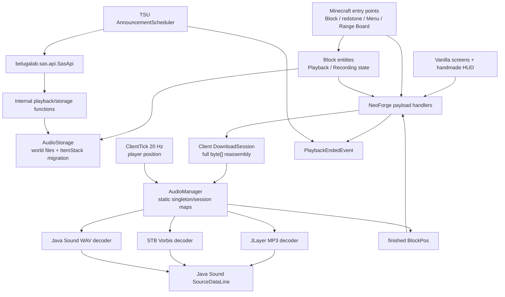
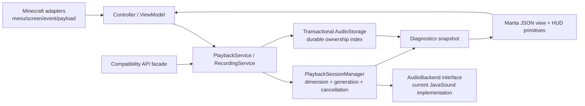

# SpatialAudioSystem 包括的コードレビュー・MantaUI移行評価

- 文書版: v1.0
- 作成日: 2026-07-17
- 改訂日: 2026-07-17
- 対象: SpatialAudioSystem 1.0.4 / Manta 1.0.2
- 対象 commit: `fdcc2955fe654017ae911063b02e3925b12ded68`
- レビュー種別: full repository

> 本文はコード、build、専用サーバー起動、Manta 1.0.2 の実在 API、TSU の実利用箇所を照合した結果である。ソース修正は行っていない。計測していない性能効果はすべて「要計測」とした。

## 1. Executive Summary

### 総合評価

SpatialAudioSystem は、単一 module・約 4,100 行の小さな構成で、block / block entity / menu / packet / client audio の主要経路を追いやすい。MP3・OGG・WAV を共通の `AudioManager` へ収束させ、10 MB 上限付きの chunk 転送、world 配下の file storage、disconnect / client level unload 時の停止 hook、公開 API を既に持つ点は強い。

一方、現在の「Spatial Audio」は OpenAL/HRTF による 3D 定位ではなく、Java Sound `SourceDataLine` へ出す音量を listener 座標から算出する scalar gain 制御である。source は block 座標に固定され、listener は player の足元を 20 Hz で更新する。左右・前後・上下の定位、listener orientation、velocity、doppler、pitch、loop、pause/resume、Minecraft sound category は実装されていない。この事実は機能欠落の断定ではなく、現行機能の正確な baseline である。

確認済みの最大リスクは次のとおり。

1. **保存データ**: process-local `knownIds` を根拠にした orphan cleanup と共有 UUID の eager delete が、正当に参照中の音声 file を不可逆に削除できる。
2. **保存 transaction**: file write に失敗しても成功 UUID を返し、recording / legacy migration が唯一の音声 data を破棄する。
3. **network authority**: C2S の block 操作に距離・menu・権限検証がなく、停止 packet は block entity の存在確認前に `PlaybackEndedEvent` を発火できる。
4. **playback identity**: dimension と playback generation が identity に含まれず、stop / restart / completion / dimension change が同じ `BlockPos` で競合する。
5. **性能**: `RangeRenderer` は毎 frame 33 × 33 = 1,089 chunks を探索する。音声は source ごとに daemon thread・`SourceDataLine`・最大 10 MB buffer を無上限に増やす。
6. **MantaUI**: 現在の移行率は 0%。さらに Manta 1.0.2 production allowlist は `spatialaudiosystem` を拒否するため、SAS 側だけを変更しても production では画面 constructor が `SecurityException` になる。

### 強い部分

- dedicated server は Java 21 / NeoForge 21.1.77 で起動完了まで到達し、common 初期化から client class を誤 load する問題は今回の検証では再現しなかった。
- codec ごとの decode 経路は一つの manager に集約され、OGG native allocation の一部には `finally` cleanup がある。
- range の 6 方向 mapping、min/max 正規化、gain clamp、0 range の除算回避はコード上整合している。
- menu / slot / block entity を MantaUI 移行後も model / Minecraft adapter として再利用できるため、機能を落とさない段階移行が可能である。
- `belugalab.sas.api.SasApi` と `PlaybackEndedEvent` は TSU で実利用されており、互換性を守る対象が明確である。

### 推奨順序

まず destructive cleanup を停止し、transactional save と network authority を直す。次に dimension + generation 付き `PlaybackSession` を導入して thread / resource / completion の所有権を一本化する。その上で Manta 側の認可 release と共通 accessibility API を先行し、Playback screen → Recording screen → Range Board HUD の順に移行する。性能最適化は source/session manager と計測 harness の後に行う。音声 backend の全面置換は前提にしない。

## 2. Review Scope

| 項目 | 確認結果 |
|---|---|
| Repository | `C:\minecraftmode\SpatialAudioSystem` |
| Branch | `master` |
| Commit | `fdcc2955fe654017ae911063b02e3925b12ded68` |
| Working tree | review 開始時・終了時とも tracked source は clean |
| Module / source set | Gradle 単一 module、`src/main/java` / `src/main/resources`。test source なし |
| Java | 21.0.8 |
| Gradle / plugin | wrapper 8.8 / NeoForge ModDev `2.0.42-beta` |
| Minecraft | 1.21.1 |
| NeoForge | build 固定 21.1.77、mods metadata は `[21.1,)` |
| Mod version | 1.0.4 |
| Audio backend | Java Sound `SourceDataLine`。MP3=JLayer、OGG=LWJGL STB Vorbis、WAV=Java Sound |
| OpenAL ownership | SAS source 内の直接利用 0 件。device/context/source/buffer ID を SAS は所有しない |
| Manta | `C:\minecraftmode\manta`, 1.0.2, commit `ea66bb0c64f01090a4ad52648af55c7944c4fc4e` |
| Manta dependency | 現行 SAS に compile/runtime/mod dependency なし |
| Public API | `belugalab.sas.api.SasApi`, `PlaybackEndedEvent` |
| Configuration | global config file / config screen / versioned config schema なし |
| Persistence | BE NBT、ItemStack DataComponents、`<world>/spatialaudiosystem_audio/<uuid>.audio` |
| Mixin / AT | なし |
| Commands | なし |
| CI / benchmark / profiler | なし |
| Unit / integration tests | 0 件 |

### 実行した検証

| 検証 | 結果 |
|---|---|
| `git status`, branch / commit / log / file inventory | 成功 |
| source / resource / caller / callee / event / packet の `rg` 監査 | 成功 |
| `java -version` | Java 21.0.8 |
| `gradlew clean build --no-daemon` | 初回は sandbox 内 network 拒否。承認後に再実行し `BUILD SUCCESSFUL`、約 85.8 秒 |
| `compileJava` / `processResources` / `jar` | build 内で成功 |
| `compileTestJava` / `test` | `NO-SOURCE`。成功した test があるという意味ではなく、test 0 件 |
| `runServer` | NeoForge 21.1.77 / Java 21.0.8 で `Done (4.768s)!` まで到達 |
| dedicated-server client-class load | 上記起動範囲では失敗なし |
| runtime dependency tree (`--offline`) | 解決成功。MP3SPI/JLayer/Tritonusを確認 |
| resource JSON parse | 20 files、syntax error 0 |
| build artifact | `build/libs/spatialaudiosystem-1.0.4.jar`, 476,137 bytes |
| Prism deploy | 規約に従い `...\mods\spatialaudiosystem-1.0.4.jar` へ配置 |

### 実行していない、または成立しない検証

- `runClient`、実ゲーム内の音声再生、GUI 操作、resource reload、dimension 往復、disconnect、Minecraft 終了は自動実行していない。
- profiler、JFR、heap/native memory 計測、0/1/16/32/64/128/256 source benchmark は harness 不在のため未実施。
- Manta layout validation は SAS に layout JSON が 0 件のため現行対象なし。
- Manta production auth は現行コードから拒否を確定できるが、未リリースの認可版 Manta での runtime test は未実施。
- audio device / mixer / OS ごとの動作、malformed codec corpus、device loss は未検証。
- target performance budget、最大同時 source 数、必須対応 OS は依頼入力に値がないため推定していない。

### 調査対象と除外

tracked source、resources、Gradle、README、CHANGELOG、MODRINTH、Manta の関連 API、TSU の SAS API consumer を調査した。生成済み `build/`、一時 `run/`、画像 pixel 内容、外部 library の内部実装は、artifact / 起動確認に必要な範囲を除いてレビュー対象外とした。

## 3. Architecture Map

### 現行依存方向

### 責務と所有権

| Layer | 現行 owner | 評価 |
|---|---|---|
| Minecraft integration | block、BE、menu、event subscriber、payload | 接続点は明確。ただし packet handler に domain logic が重複 |
| Playback state | server BE の `isPlaying` と client `AudioManager` の map | 二重状態で generation / dimension がなく、整合責任が不明確 |
| Recording state | `RecordingDeviceBlockEntity` + screen fields + server upload session | file picker thread、client UI、server pending data に分散 |
| Audio file | `AudioStorage` | file write owner は明確だが、参照 owner / refcount / durable index がない |
| Java Sound line | `AudioManager.AudioPlayback` を意図 | line open と map 登録の間、および例外経路で owner が空白になる |
| Decoder | `AudioManager` の codec method | backend と session/thread policy が一 class に集中 |
| Listener | `AudioManager` static coordinates | player 足元 20 Hz。camera/orientation owner は存在しない |
| Configuration | BE boolean/int、Range Board DataComponent | global configuration service / file は存在しない |
| Public API | `belugalab.sas.api` | internal classへ直接委譲。signature は保護対象 |
| Diagnostics | logger、range HUD/overlay | audio session/resource/perf の診断 surface はない |
| MantaUI | 現行 graph に不在 | target では adapter → controller → service の一方向にする |

### 推奨 target boundary

これは全面書き換え案ではない。まず現行 `AudioManager` と `AudioStorage` を facade の背後へ移し、packet / GUI の重複経路を一つずつ同じ service に委譲する段階導入を前提とする。

## 4. Current Feature Inventory

| Feature | Implementation / entry point | State owner | Resource owner | UI / API | Persistence | Test | Migration risk |
|---|---|---|---|---|---|---|---|
| Playback Device | block right-click、redstone rising edge、GUI play/stop | `PlaybackDeviceBlockEntity` | client `AudioManager` | Playback screen | BE NBT / inventory | なし | 高 |
| Recording Device | GUI file select → upload → 100 tick write | `RecordingDeviceBlockEntity` | pending `byte[]` + `AudioStorage` | Recording screen | BE NBT は progress/flag/inventoryのみ | なし | 高 |
| Recording Medium | MP3/OGG/WAV metadata + UUID | ItemStack DataComponents | world audio file | item tooltip | ItemStack + file | なし | 中 |
| MP3 playback | `AudioManager#streamMp3` / JLayer | playback worker | `Bitstream`, `SourceDataLine` | device/API 経由 | なし | なし | 低 |
| OGG playback | `AudioManager#streamOgg` / STB Vorbis | playback worker | native vorbis/direct buffers/line | device/API 経由 | なし | なし | 低 |
| WAV playback | `AudioManager#streamWav` / Java Sound | playback worker | streams/line | device/API 経由 | なし | なし | 低 |
| Audio upload | 500 KiB C2S chunks、最大 10 MB | server `UploadSession` | full server `byte[]` | Recording screen | recording 完了時 file | なし | 高 |
| Audio download | metadata + 500 KiB S2C chunks | client `DownloadSession` | full client `byte[]` | 直接 UI なし | なし | なし | 高 |
| Server audio storage | `<world>/spatialaudiosystem_audio/<uuid>.audio` | `AudioStorage` static state | filesystem | API/BE 経由 | file | なし | 高 |
| Legacy item migration | `AUDIO_DATA` → file + `AUDIO_ID` | `AudioStorage` | filesystem | 自動 | ItemStack schema | なし | 高 |
| Source position | 再生開始時の `BlockPos` center | `AudioPlayback` | なし | API pos | なし | なし | 低 |
| Source movement update | **未実装** | — | — | — | — | — | — |
| Listener position | `ClientTickEvent.Post`、player X/Y/Z 20 Hz | `AudioManager` static coordinates | なし | 直接 UI なし | なし | なし | 中 |
| Listener orientation / velocity | **未実装** | — | — | — | — | — | — |
| Range hard gate | Range Board 2 points → AABB | playback snapshot | なし | board / Playback screen | ItemStack | なし | 中 |
| Six-direction attenuation | E/W/U/D/S/N の軸別線形係数を積算 | Range Board DataComponent | `FloatControl` | HUD wheel | ItemStack | なし | 高 |
| No-range attenuation | source centerから160 blockの球状線形 gain | `AudioPlayback` | `FloatControl` | API/device | なし | なし | 低 |
| Volume control | scalar gain → `MASTER_GAIN` dB | `AudioPlayback` | mixer control | range settings | rangeのみ保存 | なし | 中 |
| Left/right/front/back/up/down localization | **未実装**。方向別 range は定位ではなく音量係数 | — | — | — | — | — | — |
| Pitch / loop / pause / resume | **未実装** | — | — | — | — | — | — |
| Source switching | 新 play が同一 pos を stop して再開始するのみ。明示 API はなし | `AudioManager` map | line | play API | なし | なし | 高 |
| Minecraft sound category/master slider | **未実装**。Java Sound 直出力 | — | OS mixer | — | — | — | — |
| Playback timeout | 12,000 server ticks | Playback BE | — | 自動 | start tick は非永続 | なし | 中 |
| Range Board selection | right-click / 64 block raycast、Shift clear | ItemStack | — | item + HUD | DataComponents | なし | 高 |
| Range Board HUD | mode、説明、方向値、通知、item name | static HUD fields | textures | Alt/Ctrl wheel | modeは非永続 | なし | 高 |
| World range overlay | held board / visible device の AABB lines | renderer static smooth state | render buffers | HUD mode連動 | BE/ItemStack | なし | 中 |
| World exit / disconnect | logging out + client level unload → stopAll / session clear | client lifecycle handler | active line | 自動 | なし | なし | 高 |
| Dimension switch | old client level unloadで全停止 | client lifecycle handler | active line | 自動 | identityにdimensionなし | なし | 高 |
| Resource reload | audio固有 hook **なし** | — | active line継続 | Vanilla texture reloadのみ暗黙 | — | なし | 中 |
| Minecraft shutdown | explicit SAS shutdown hook **なし** | daemon workerに依存 | line/thread | — | — | なし | 高 |
| Settings | show range、attenuation mode/ranges | BE / ItemStack | — | screen/HUD | BE NBT / DataComponent | なし | 高 |
| Global config load/save | **存在しない** | — | — | config screenなし | config fileなし | — | — |
| Public API | `SasApi` play/stop/audio metadata helpers、`PlaybackEndedEvent` | facade + internal state | internal storage/line | TSU consumer | existing signatures | なし | 高 |
| Command operation | **存在しない** | — | — | — | — | — | — |
| Diagnostics | logs、range可視化 | logger / renderers | — | HUD/overlay | なし | なし | 中 |
| MantaUI | **0% / 未実装** | — | — | Vanilla 2 screen + handmade HUD | layout JSONなし | なし | 高 |

## 5. Execution Paths

### Initialization

`@Mod → SpatialAudioSystem constructor → block/item/BE/menu/DataComponent register → FMLCommonSetupEvent log`

audio backend の eager initialization、device capability probe、config load、shutdown owner はない。decoder と `SourceDataLine` は最初の playback worker 内で lazy open される。client UI / event subscriber は `Dist.CLIENT` annotation で分離され、専用サーバー起動は完了した。

### World join

明示的な audio service activation / source discovery / listener initialize hook はない。player が存在する client tick から座標 cache が有効になり、server が play packet を送った時だけ session を生成する。

### Sound play

`GUI / redstone / SasApi → server loadForItem → ClientPlayAudioPayload → DownloadSession allocate → ClientAudioChunkPayload × N → AudioManager.playAudio → per-source daemon worker → codec decode → SourceDataLine open/start/write/drain → close → finishedPlaybacks`

redstone と API は BE/API 側、GUI は packet handler 側に同等処理を重複実装している。server は全 dimension の全 player へ broadcast する。

### Listener / source update

`ClientTickEvent.Post (20 Hz) → mc.player X/Y/Z → AudioManager.updateLocalPlayerPos → activePlaybacks loop → gain calculation → FloatControl.setValue`

source は開始時 `BlockPos` 固定で更新経路なし。camera position、partial tick、orientation、velocity、audio-thread queue はない。client tick から Java Sound control を直接更新する。

### Sound stop / natural completion

`GUI / block remove / API → ClientStopAudioPayload → AudioManager.stopAudio → AudioPlayback.stop`

自然完了は worker `finally → finishedPlaybacks → next ClientTick → PlaybackControlPayload(false) → server PlaybackEndedEvent → BE state false + stop broadcast`。identity は `BlockPos` のみで generation / dimension がない。

### Configuration apply

global config はない。Playback screen の toggle は local boolean を先に反転し C2S を送信する。Range Board は wheel で client ItemStack を即時更新し C2S で server copyを clampする。apply / cancel transaction、error response、rollback はない。

### UI open / close

`block useWithoutItem → ServerPlayer.openMenu → MenuProvider / AbstractContainerMenu → RegisterMenuScreensEvent → AbstractContainerScreen`

MantaUI path は現行 0 件。close 時の UI listener cleanup は不要な構成だが、Recording file chooser worker は screen close 後も継続できる。

### Resource reload

audio file は resource pack 管理外であり、active decoder / line の suspend・recreate hook はない。Vanilla GUI textures は Minecraft resource manager に任せている。Manta 移行後の JSON layout reload / controller rebind は未実装・未検証。

### Disconnect / dimension change / shutdown

LoggingOut と client Level unload は `stopAll()` と download session clear を呼ぶ。pending audio worker、finished completion set、listener validity、server upload session は完全には reset されない。explicit client shutdown / server stop hook はなく、daemon thread と level unload の発火に依存する。

## 6. Verified Findings

### `[P0][SAS-STORAGE-001] 非永続の参照集合を使う GC と eager delete が正当に参照中の音声 file を削除する`

**Area:** Storage / Lifecycle / Data integrity

**Location:**

- `src/main/java/com/spatialaudiosystem/audio/AudioStorage.java:117-179` — `cleanupOrphans`, `knownIds`, `collectReferencedIds`
- `src/main/java/com/spatialaudiosystem/server/ServerTickHandler.java:17-29` — 6,000 tick ごとの cleanup
- `src/main/java/com/spatialaudiosystem/blockentity/RecordingDeviceBlockEntity.java:105-124` — `clearMediaAudioData`

**Confidence:** High

**Trigger:**

1. 1時間以上前の recording medium を unloaded chunk の chest、他 Mod container、drop 等に置く。
2. server restart により process-local `knownIds` が空になる。
3. 起動後 6,000 tick で `collectReferencedIds` が online player inventory と空の `knownIds` だけを返す。
4. cutoff より古い正当な `.audio` が orphan と判定され削除される。

別経路として、同じ `AUDIO_ID` を持つ ItemStack を複製し、一方を Recording Device の clear 対象にすると、他方の参照確認なしに共有 file が即削除される。

**Call path:**

`ServerTickEvent.Post → collectReferencedIds → cleanupOrphans → Files.deleteIfExists`

`Recording screen clear → ClearAudioPayload → clearMediaAudioData → AudioStorage.delete`

**Thread:** Server main

**Lifecycle:** Restart / periodic cleanup / item clear

**Current behavior:** `knownIds` は save/load/migrate の実行時だけ増える非永続 set であり、参照数でも authoritative index でもない。1時間 cutoff は unloaded reference の存在を証明しない。

**Expected behavior:** file は durable owner/reference が 0 と確定した時だけ回収される。参照の所在や server restart によって有効 data を失わない。

**Impact:** ユーザーが保存した音声の不可逆消失。逆に同一 process 中は `knownIds` が減らないため、真の orphan を回収できない側にも振れる。

**Evidence:** block entity inventory を列挙する処理、unloaded chunk を表す永続 index、refcount、shared UUID 検査は source 全体に存在しない。comment の「knownIds が block entity を cover」は load/play された item にしか成立しない。

**Why existing guards are insufficient:** 1時間は owner 検査の代替にならず、player inventory scan は他の保存場所を網羅しない。`try/catch` は誤削除の判定を防がない。

**Minimal fix:**

1. 即時 hotfix として scheduled delete と stack 単位の eager physical delete を無効化し、logical metadata clear のみにする。
2. world `SavedData` に content ID の durable ownership model を導入する。ItemStack 複製を許す現行仕様では単純な stack refcount の正確な維持が難しいため、明示 owner ID または conservative mark/quarantine + delayed sweep を採用する。
3. 回収候補・参照数・最終確認時刻を診断表示し、物理削除前に再検証する。

**Performance impact:** hotfix は disk 使用量を増やし得る。durable index の lookup は O(1) を目標とし、world 全 chunk scan を定期 hot path に入れない。効果・disk 増加量は要計測。

**Regression test:** unloaded container 参照 + restart + cutoff 超過後も file が残る。同じ UUID の stack A/B で A を clear 後も B から load できる。最終 owner がなくなった候補だけが quarantine 後に回収される。

---

### `[P0][SAS-STORAGE-002] file write 失敗を成功として確定し recording / legacy data を破棄する`

**Area:** Storage / Failure recovery / Compatibility

**Location:**

- `src/main/java/com/spatialaudiosystem/audio/AudioStorage.java:41-51` — `save`
- `src/main/java/com/spatialaudiosystem/audio/AudioStorage.java:89-100` — `migrateIfNeeded`
- `src/main/java/com/spatialaudiosystem/blockentity/RecordingDeviceBlockEntity.java:148-170` — `finishRecording`

**Confidence:** High

**Trigger:** disk full、permission error、I/O failure、partial write 等で `Files.write` が失敗する。

**Call path:**

`finishRecording → AudioStorage.save → IOException catch/log → UUID return → AUDIO_ID set → input/pending data discard`

`loadForItem / BE migration → migrateIfNeeded → save failure → AUDIO_ID set → legacy AUDIO_DATA remove`

**Thread:** Server main

**Lifecycle:** Recording completion / legacy migration / persistence

**Current behavior:** `save` は失敗を log しても常に新 UUID を返す。caller は成功/失敗を区別できず、file がない UUID を保存して唯一の bytes を破棄する。write は temp + atomic move でもない。

**Expected behavior:** durable commit が完了した場合だけ UUID と item state を公開する。失敗時は input、pending bytes、legacy bytes を保持して再試行または cancel できる。

**Impact:** medium は filename/UUID 付きに見えるが再生不能となり、legacy migration では回復可能な元 data まで消える。ユーザー data の不可逆破損に該当する。

**Evidence:** catch 後の unconditional `return id` と、caller の unconditional `set(AUDIO_ID)` / `remove(AUDIO_DATA)` / pending clear。

**Why existing guards are insufficient:** `load` の null return は破損後に検知するだけで復元しない。logger は transaction rollback ではない。

**Minimal fix:** `save` を `Optional<UUID>` または明示 `SaveResult` にし、同じ directory の temp file へ write + fsync 方針を定めて atomic move する。成功時だけ item mutation を行う。失敗は UI/controller へ reason code で返す。

**Performance impact:** atomic commit は recording 完了時だけの I/O であり audio tick hot path ではない。fsync 方針の latency は要計測。

**Regression test:** filesystem fault injection で write / move failure を作り、fileなし、`AUDIO_ID`なし、legacy `AUDIO_DATA`保持、input/pending保持、error response を assertする。成功経路では temp 残骸がないことも確認する。

---

### `[P1][SAS-NET-003] C2S の BlockPos 操作に interaction authority がなく、遠隔変更と completion event 偽装ができる`

**Area:** Security / Networking / API integration

**Location:**

- `src/main/java/com/spatialaudiosystem/network/PlaybackControlPayload.java:38-93`
- `src/main/java/com/spatialaudiosystem/network/StartRecordingPayload.java:29-35`
- `src/main/java/com/spatialaudiosystem/network/ClearAudioPayload.java:29-36`
- `src/main/java/com/spatialaudiosystem/network/ToggleRangeDisplayPayload.java:29-35`
- `src/main/java/com/spatialaudiosystem/network/ToggleAttenuationPayload.java:29-35`
- `src/main/java/com/spatialaudiosystem/network/SetAttenuationRangePayload.java:30-36`
- `src/main/java/com/spatialaudiosystem/network/AudioUploadStartPayload.java:37-47`
- `src/main/java/com/spatialaudiosystem/network/AudioUploadChunkPayload.java:59-90`

**Confidence:** High

**Trigger:** modded client が任意の loaded `BlockPos` を含む C2S payload を直接送る。screen/menu を開いている必要も、block の近くにいる必要もない。

**Call path:** `untrusted C2S → context.enqueueWork → player.level().getBlockEntity(pos) → BE mutation/play/clear`

特に stop は `PlaybackControlPayload(false) → PlaybackEndedEvent` を block entity の型確認より前に実行するため、存在しない任意 pos でも integration event を作れる。

**Thread:** Network decode → Server main enqueue

**Lifecycle:** Runtime / multiplayer / Mod integration

**Current behavior:** packet の sender は取るが、current menu、menu の BE pos、`stillValid`、distance、dimension/session token、permission、rate を検査しない。

**Expected behavior:** GUI 操作は「sender が対応 menu を開き、同じ BE を操作可能」という server-authoritative invariant を満たす。自然完了は一般 stop command ではなく、server が発行した playback ID に対する completion acknowledgement とする。

**Impact:** 遠隔再生/停止、range表示・attenuation変更、recording pending data clear、recording開始、別 device への upload、TSU 等が購読する completion sequence の不正進行が可能。

**Evidence:** 全 sister handler を検索し、`getBlockEntity(payload.pos)` 前の authority guard がないことを確認した。menu 自体の `stillValid` は packet handler から呼ばれない。

**Why existing guards are insufficient:** BE `instanceof` は型だけを検査する。server main へ enqueue することは thread affinity を満たすだけで権限を付与しない。upload 10 MB guard も対象 device の操作権を検査しない。

**Minimal fix:** `ServerInteractionGuard.requireOpenMenu(player, expectedMenu, pos)` を共通化し、same level、menu identity、`stillValid` / reach、block type、rate を一度に検査する。Range Board hand 操作は実際の held item を server 側で検査する。completion は `playbackId` を照合し、一般 stop action と event acknowledgement を分離する。

**Performance impact:** packet 受信時の O(1) 検査。tick/render hot path への影響なし。

**Regression test:** menuなし、遠距離、別 dimension、別 BE pos、閉じた menu、rate超過を拒否し state/event が不変。正しい menu/pos の操作だけ従来 payload semantics を維持する。

---

### `[P1][SAS-NET-004] chunk protocol の長さ・順序・重複検証がなく、server/client の例外・OOM・不完全 data 確定を許す`

**Area:** Security / Streaming / Memory / Lifecycle

**Location:**

- `src/main/java/com/spatialaudiosystem/network/AudioUploadStartPayload.java:32-46`
- `src/main/java/com/spatialaudiosystem/network/AudioUploadChunkPayload.java:41-42,47-90,99-117`
- `src/main/java/com/spatialaudiosystem/network/ClientPlayAudioPayload.java:45-64`
- `src/main/java/com/spatialaudiosystem/network/ClientAudioChunkPayload.java:36-38,43-87,107-126`
- `src/main/java/com/spatialaudiosystem/network/SetRangeBoardDataPayload.java:32-37`
- `src/main/java/com/spatialaudiosystem/item/ModDataComponents.java:83-90`

**Confidence:** High

**Trigger:** negative / oversized `totalSize`、negative / inconsistent `chunkCount`、negative / overflowed / duplicate `chunkIndex`、短い・長い最終 chunk、unbounded range list、または server から不正 playback metadata を送る。

**Call path:**

`AudioUploadStartPayload → new UploadSession → new byte[totalSize]`

`AudioUploadChunkPayload → offset = chunkIndex * CHUNK_SIZE → arraycopy / receivedChunks++ → early finalize`

`ClientPlayAudioPayload → int[len] / DownloadSession byte[totalSize]`

**Thread:** Network decode、続いて server/client main

**Lifecycle:** Upload / download / disconnect / timeout

**Current behavior:** upload start は `totalSize > 10 MB` だけを拒否し、負値や chunk count を受理する。chunk は index の範囲・重複・expected length を検査せず、重複でも `receivedChunks` を増やす。client metadata の size / attenuation array length は無上限。`SetRangeBoardDataPayload` は handler の size=6 guard より前に `new ArrayList<>(size)` を行い、ItemStackのnetwork-synchronized `ATTENUATION_RANGES` codecも同じ無上限list decodeを持つ。30秒 timeout は次の session 開始時だけ sweep されるため、`CHANGELOG-EN.md:47-48` / `CHANGELOG.md:49-50` の「30秒で自動破棄・disconnect leak防止」とも一致しない。

**Expected behavior:** codec decode の時点で hard cap を設け、session は server-issued ID、expected total/chunk count、index BitSet、各 chunk length、総受信 byte 数を一致させる。期限・logout・disconnect・stop・server stop で time-driven cleanup する。

**Impact:** server task exception、client/server heap圧迫または OOM、不完全/zero-filled audio の recording、最大10 MB session の残留、同一 pos session の上書き。悪意がなくても packet loss/retry 相当の順序変化へ弱い。

**Evidence:** `receivedChunks` は unique index 数ではなく受信回数。offset の int multiplication と `buffer.length - offset` に事前範囲検査がない。client `DownloadSession` は server metadata の size をそのまま allocation する。

**Why existing guards are insufficient:** `readByteArray(CHUNK_SIZE + 1024)` は一個の chunk size だけを制限する。finish 時 `validateSize(session.buffer)` を呼んでも、allocation・copy・早期 finalize の後である。passive `removeIf` は時間経過だけでは動かない。

**Minimal fix:** bounded `StreamCodec`、`0 < totalSize <= MAX`、`chunkCount == ceil(totalSize/CHUNK_SIZE)`、index range、exact chunk length、duplicate reject、received byte count、format allowlist、filename byte/char capを導入する。server/client 双方に定期 sweep と lifecycle clear を追加する。

**Performance impact:** BitSet と O(1) validation は小さい。不要な allocation / copy / malformed decode を早期拒否できる。heap peak は source/session budget と併せて要計測。

**Regression test:** boundary 0/1/10 MB/10 MB+1、negative size/count/index、overflow index、duplicate/out-of-order/missing/oversized/undersized chunk、31秒 timeout、logout、malicious S2C metadata を parameterized/fuzz test する。失敗時に session map と buffer reference が残らないことを assertする。

---

### `[P1][SAS-AUDIO-005] playback identity が BlockPos のみで、stop・restart・dimension・completion の世代を分離できない`

**Area:** Audio / Threading / Lifecycle / Compatibility

**Location:**

- `src/main/java/com/spatialaudiosystem/audio/AudioManager.java:26-29,67-103,379-393`
- `src/main/java/com/spatialaudiosystem/network/ClientAudioChunkPayload.java:43-87`
- `src/main/java/com/spatialaudiosystem/network/ClientStopAudioPayload.java:30-32`
- `src/main/java/com/spatialaudiosystem/client/ClientTickHandler.java:23-34`
- `src/main/java/com/spatialaudiosystem/client/ClientLifecycleHandler.java:25-35`
- `src/main/java/com/spatialaudiosystem/blockentity/PlaybackDeviceBlockEntity.java:158-179`
- `src/main/java/com/spatialaudiosystem/network/PlaybackControlPayload.java:43-93`
- `src/main/java/belugalab/sas/api/SasApi.java:152-205`
- `src/main/java/belugalab/sas/api/PlaybackEndedEvent.java:8-32`
- consumer: `C:\minecraftmode\Trainsystemutilities\src\main\java\com\trainsystemutilities\announcement\AnnouncementScheduler.java:350-381`

**Confidence:** High

**Trigger:** metadata後/最終chunk前の stop、decoder/line open 中の stop、同じ pos の短時間 restart、別 dimension の同じ数値 pos、再生中の dimension change、前世代 worker の遅い `finally`。

**Call path:** `play A → pending worker A → stop/replay B → worker A/B race → activePlaybacks.put(pos) / finishedPlaybacks.add(pos) → C2S false → current server state/eventを停止`

**Thread:** Client main + `SSS-Audio-*` workers + Server main

**Lifecycle:** Runtime / stop / disconnect / dimension change / natural completion

**Current behavior:** active/pending/finished/download は `BlockPos` key。`pendingPlaybacks.remove(pos)` は worker が観測する cancellation token ではない。stop は download session を cancel しない。server は source level ではなく全 online players へ broadcast する。completion は sender の現在 level と pos だけで event を作る。

**Expected behavior:** `SessionKey(dimension, sourcePos, playbackId/generation)` が metadata、chunk、active session、stop、completion、event を一貫して識別し、旧 generation の処理は現 generation を変更しない。

**Impact:** stop/block破壊/disconnect後に遅れて再生開始、同一 pos の二重 line と orphan、旧 finish が新 playback を停止、別 dimension の同一 pos 衝突、誤った level の `PlaybackEndedEvent`。TSU は event 受信後すぐ次の announcement を同じ pos で開始するため、遅い旧 event が新世代を進める具体的 consumer が存在する。

**Evidence:** `ConcurrentHashMap<BlockPos,...>` と全player loopを確認。`AudioManager` が受け取る `Level` は identity/routing に使用されない。`PlaybackEndedEvent` 自身も「playerごとに発火」と明記するが generation は提供しない。

**Why existing guards are insufficient:** compare-remove は map の誤 remove の一部だけを防ぎ、orphan line・finished set・download session・server eventを防がない。Level unload の全停止は worker cancellation の保証にならない。

**Minimal fix:** source level の player だけへ送信する即時修正に続き、原子的 `PlaybackSession` を manager へ登録してから worker を開始する。worker は decode前・line open後・start前に token を確認し、stopAll は download/session/finished/listener validity を一括 resetする。公開 API は既存 signature を維持し、session handle を返す新 overload/event fieldを追加して legacy pathを deprecated期間中 adapter化する。

**Performance impact:** session object/token compare の O(1) cost。別 dimension への不要な full audio 転送が消えるため network/heap は改善する。効果は要計測。

**Regression test:** latch付き fake backendで pending stop、A/B restart、old finally、world A→B、2 dimension同一pos、download途中stopを決定的に再現する。旧 generation completion が新 session / TSU consumer event を変更しないことを assertする。

---

### `[P1][SAS-AUDIO-006] GUI play だけ playbackStartTick を設定せず、通常の古い world で次 tick に停止する`

**Area:** Audio / State management / UI

**Location:**

- `src/main/java/com/spatialaudiosystem/screen/PlaybackDeviceScreen.java:102-112`
- `src/main/java/com/spatialaudiosystem/network/PlaybackControlPayload.java:51-81`
- `src/main/java/com/spatialaudiosystem/blockentity/PlaybackDeviceBlockEntity.java:62-65,90-96,134-166,192-198`

**Confidence:** High

**Trigger:** game time が 12,000 ticks を超えた world で Playback screen の play button を押す。

**Call path:** `IconButton → PlaybackControlPayload(play=true) → be.setIsPlaying(true) → next BE tick → gameTime - 0 > 12000 → stopPlayback`

**Thread:** Client main → Server main

**Lifecycle:** Runtime playback

**Current behavior:** redstone path の `startPlayback()` は timestamp を設定するが、GUI packet handler は playback logic を複製して `setIsPlaying(true)` のみを呼ぶ。以前の timestamp が残る場合も新開始時刻にならない。

**Expected behavior:** GUI、redstone、public API の開始は同じ server service/state transition を通り、開始時刻・generation・broadcast が一度だけ設定される。

**Impact:** 10分以上経過した一般的な world で GUI playback がほぼ即停止する主要機能障害。

**Evidence:** `setIsPlaying` に timestamp update はなく、BE tick は保存されない初期値0と world timeを比較する。

**Why existing guards are insufficient:** 12,000 tick timeout 自体は存在するが、誤った基準時刻を使う。正しい sister implementation は呼ばれていない。

**Minimal fix:** packet handler から重複再生処理を除き、authority 検査後に単一 `startPlayback` serviceへ委譲する。

**Performance impact:** 重複コード削減のみ。hot path影響なし。

**Regression test:** gameTime > 12,000 で GUI相当start後の次 tickでもplaying、開始から12,000 tickまでは継続、閾値後だけstop。redstone/APIとも同じ invariant を parameterized testする。

---

### `[P1][SAS-MANTA-007] Manta 1.0.2 は production で SAS caller を拒否し、SAS 側にも dependency がない`

**Area:** MantaUI / Build / Compatibility

**Location:**

- `C:\minecraftmode\manta\src\main\java\com\manta\MantaAuth.java:62-67,73,89-123`
- `C:\minecraftmode\manta\src\main\java\com\manta\MantaIntegrity.java:34-38`
- `C:\minecraftmode\manta\src\main\java\belugalab\mcss3\screen\JsonLayoutScreen.java:128-132`
- `C:\minecraftmode\manta\src\main\java\belugalab\mcss3\screen\JsonLayoutPlainScreen.java:75-78`
- `build.gradle:45-50`
- `src/main/resources/META-INF/neoforge.mods.toml:18-30`

**Confidence:** High

**Trigger:** SAS screen を `JsonLayoutScreen` / `JsonLayoutPlainScreen` に変更し、現行 Manta 1.0.2 と production jar で開く。

**Call path:** `block right-click → openMenu → screen factory → SAS Manta screen constructor → MantaAuth.requireAuthorizedCaller → SecurityException`

**Thread:** Client main

**Lifecycle:** Screen initialization / production runtime

**Current behavior:** Manta allowlist は `manta`, `trainsystemutilities`, `neoforge`, `minecraft` の4件だけ。dev/userdev は auth を skip するため開発環境だけでは通って見える。allowlist checksum も4件の baseline。SAS build/mod metadata に Manta dependency はない。

**Expected behavior:** Manta が `spatialaudiosystem` を正式認可した release を先に作り、checksum testを更新する。SAS はその最初の認可版を required dependency として宣言し、再現可能な artifact source を使う。

**Impact:** 前提を解かずに UI を移行すると production で2画面とも開けず、主要機能を失う。sibling jar 直参照だけでは公開 repo / CI の再現性も満たさない。

**Evidence:** constructorから unconditional auth call、dev skip、hardcoded allowlist/checksum、SAS dependency 0 を照合した。

**Why existing guards are insufficient:** dev skip は production parity を保証しない。`mods.toml` に optional/required Manta entryがなく、loader は必要 versionを保証しない。

**Minimal fix:** Manta repo で allowlist + checksum + checksum testを同時更新して releaseする。その version が確定するまで架空の具体 versionを記載せず、設計上は `[first-authorizing-release,2)` とする。SAS は正式 artifact の compile dependency と required runtime dependencyを追加する。

**Performance impact:** なし。起動/互換性前提。

**Regression test:** devだけでなく production artifactで SAS screenを開く。unauthorized probeは引き続き拒否し、SASだけ許可される。Manta欠落/古いversionではloaderが明確に起動を拒否し、dedicated serverではclient screen classをloadしない。

---

### `[P1][SAS-COMPAT-008] 1.0.3 → 1.0.4 rename に registry/DataComponent/storage migration がなく、既存world資産を認識できない`

**Area:** Saved-data compatibility / Migration

**Location:**

- `CHANGELOG.md:7-16` / `CHANGELOG-EN.md:7-16`
- current `src/main/java/com/spatialaudiosystem/audio/AudioStorage.java:32-35`
- historical `fa6ff5b:src/main/resources/META-INF/neoforge.mods.toml` — mod id `stationsoundsystem`
- historical `fa6ff5b:src/main/java/com/example/stationsoundsystem/audio/AudioStorage.java` — directory `stationsoundsystem_audio`
- current tree 全体 — old namespace mapping / directory fallback 0件

**Confidence:** High

**Trigger:** 1.0.3以前のworldを現行1.0.4で開く。

**Call path:** `world registry/item/BE/DataComponent load → old stationsoundsystem IDs → current spatialaudiosystem registry only`; `AUDIO_ID → current spatialaudiosystem_audio directory lookup`

**Thread:** World/server load

**Lifecycle:** Version upgrade / saved-data load

**Current behavior:** changelog自身が旧item/blockを認識しないと明記する。renameでmod/registry/DataComponent namespaceとstorage directoryが変わったが、old ID remap、old component/data conversion、old directory fallback/moveがない。現行 `AUDIO_DATA` migrationは「現行namespaceでdecode済みのlegacy component」だけを対象とし、旧registry namespaceを復元しない。

**Expected behavior:** 既存world資産を保持する方針なら、旧IDをcurrent IDへ段階移行し、旧storage directoryをidempotentかつtransactionalに移す。非対応とするならbreaking major versionと明示し、今回の「保存互換維持」対象を1.0.4以降に限定する合意が必要。

**Impact:** 旧worldの主要block/item/DataComponentと録音fileがそのまま利用できない。物理fileは残ってもcurrent lookupから到達不能になる。

**Evidence:** current/historical git objectとchangelogを比較し、current sourceに`stationsoundsystem`、missing mapping、directory migrationがないことを確認した。

**Why existing guards are insufficient:** `migrateIfNeeded` はcurrent ItemStackに`AUDIO_DATA`がdecodeできた後しか実行されない。UUID filenameの同一性だけではdirectory renameを越えない。

**Minimal fix:** まず実物1.0.3 world fixtureを凍結する。NeoForge 1.21.1で正式にサポートされるregistry remap/migration hookを用い、旧IDsとDataComponentsをcurrentへ変換する。directoryはcopy/verify/atomic marker方式でidempotentに移行し、成功後もしばらくold fallbackをread-onlyで保持する。

**Performance impact:** upgrade時限定。通常tick影響なし。大容量worldのmigration時間/disk二重使用量は要計測。

**Regression test:** 1.0.3実world fixtureのblock、BE inventory、player/chest item、Range Board data、audio fileを1.0.4+へ一度/二度upgradeし、registry認識、UUID/file再生、冪等性、失敗rollbackをassertする。

---

### `[P2][SAS-UI-009] file picker worker が screen state と network を直接操作し、close後upload・visibility race・過大heap allocationを起こせる`

**Area:** MantaUI / Threading / File handling

**Location:**

- `src/main/java/com/spatialaudiosystem/screen/RecordingDeviceScreen.java:50-52,96-159`
- `src/main/java/com/spatialaudiosystem/network/AudioUploadStartPayload.java:37-47`
- `src/main/java/com/spatialaudiosystem/blockentity/RecordingDeviceBlockEntity.java:86-90,127-135,225-239`

**Confidence:** High

**Trigger:** file dialog を開いている間に screen を閉じる/別worldへ移る、非常に大きいfileを選ぶ、worker と render が同時に selection fieldsへ触る。

**Call path:** `IconButton → daemon SSS-FileChooser → tinyfd → Files.readAllBytes → screen fields mutation → PacketDistributor.sendToServer`

**Thread:** Native file chooser worker。結果の main-thread marshal なし。

**Lifecycle:** UI open/close / world change / upload

**Current behavior:** client 10 MB preflight 前に file 全体を heap へ読む。worker が non-volatile screen fields、`menu.getBlockEntity()`、network send を直接扱い、screen generation / connection / menu validity を再確認しない。server pending filename/format は update tagへ同期されず、reopen後の表示も完全ではない。

**Expected behavior:** native picker は path/resultだけを返す薄い service。sizeをread前に検査し、bounded streamでupload準備し、`Minecraft#execute` 上の current controllerへ immutable resultを渡す。close/unloadでgenerationをinvalidate/cancelする。

**Impact:** 選択した巨大fileでclient OOM、閉じた古いscreenから別/stale deviceへのupload、表示race、reopen時のstate不整合。開始失敗理由もUIへ返らない。

**Evidence:** `Files.readAllBytes` は size check より前。worker内でfield代入と全payload送信を行う。同期 primitive / `Minecraft#execute` / screen alive guard はない。

**Why existing guards are insufficient:** serverの10 MB拒否は client allocation/upload後であり、古いscreen lifecycleを検査しない。daemon化はcancelではない。

**Minimal fix:** `AudioFilePickerService` + `RecordingScreenController` を導入し、main-thread handoff、generation token、preflight size、format/magic validation、bounded upload、server error responseを実装する。Manta viewはcontroller snapshotだけを描画する。

**Performance impact:** 超過fileの全read/chunk copyを回避。正常10 MB時のpeak heap/latencyは要計測。

**Regression test:** MP3/OGG/WAV、dialog cancel、IOException、10 MB境界/超過、screen close中の完了、dimension/disconnect、再選択をfake pickerで検証し、stale controllerからpacket 0件・buffer参照0件をassertする。

---

### `[P2][SAS-AUDIO-009] codec/write例外時に SourceDataLine と Java stream の close が保証されない`

**Area:** Audio / Resource ownership / Failure recovery

**Location:**

- MP3: `src/main/java/com/spatialaudiosystem/audio/AudioManager.java:105-168`
- OGG: `src/main/java/com/spatialaudiosystem/audio/AudioManager.java:171-243`
- WAV: `src/main/java/com/spatialaudiosystem/audio/AudioManager.java:246-304`
- worker wrapper: `src/main/java/com/spatialaudiosystem/audio/AudioManager.java:76-99`

**Confidence:** High

**Trigger:** line open後の malformed frame、decoder exception、`line.write` / `drain` exception、device loss。

**Call path:** `AudioManager worker → codec stream method → line.open/start → exception → outer catch/log → finally map cleanup`

**Thread:** `SSS-Audio-*`

**Lifecycle:** Playback / decoder failure / device failure

**Current behavior:** normal tailでは line/streamを閉じるが、MP3 `Bitstream` / line、WAV streams / line、OGG lineを method-level `finally` で必ず閉じない。stream methodの代入が完了する前にthrowすると outer `thisPlayback` は null のままで、ownerからstopできない。OGG native vorbis/direct bufferは一部finally解放済み。

**Expected behavior:** line open直後から一つの session ownerが idempotent closeを担い、どのthrow/cancel pathでも逆順cleanupする。

**Impact:** mixer line、stream、provider resourceの残留。繰り返す malformed media/device error で再生不能またはresource exhaustionへ悪化し得る。

**Evidence:** codec methodのcloseはhappy tailにあり、outer catchはlogだけ。`AudioPlayback.stop()` はmanagerが既に参照を得た経路にしか効かない。

**Why existing guards are insufficient:** map removalはnative/Java Sound resourceをcloseしない。GC/provider finalizationの時期は保証されない。

**Minimal fix:** codecごとのtry/finallyまたはcloseable session ownerへline/stream/native handleを即登録し、closeをidempotent化する。exceptionは reason codeとしてdiagnosticsへ保持する。

**Performance impact:** 正常時はほぼなし。失敗反復時のresource plateauを改善。要計測。

**Regression test:** fake lineをopen/start/write/drainの各点でthrowさせ、stop/close各1回、active/pending map空、worker終了、STB allocation balance 0をassertする。

---

### `[P2][SAS-LIFE-010] 再開不能な in-flight flag だけを NBT 保存し、reload後に phantom play / 永久 recording を作る`

**Area:** Lifecycle / Persistence / State ownership

**Location:**

- `src/main/java/com/spatialaudiosystem/blockentity/PlaybackDeviceBlockEntity.java:58-65,192-218`
- `src/main/java/com/spatialaudiosystem/blockentity/RecordingDeviceBlockEntity.java:48-53,138-170,182-199`

**Confidence:** High

**Trigger:** playback中または5秒 recording write中にworld save/restart/chunk unload-reloadする。

**Call path:** `runtime state → saveAdditional → restart/loadAdditional → tick`

**Thread:** Server main

**Lifecycle:** Save / load / restart / chunk lifecycle

**Current behavior:** playbackは `isPlaying` を保存するが start tick、client session、再生位置を保存しない。recordingは `isRecording` と progressを保存するが pending bytes/name/formatを保存しない。load後 recording tickは `pendingAudioData == null` で永久returnする。

**Expected behavior:** in-flight stateをtransientと定義するならload時に明示cancel/resetする。resumeを要件にするならdata/sessionまでtransactionalに永続化する。現在の機能を保つ最小策は前者。

**Impact:** GUI/BEはplayingなのに音がない、world age依存でphantom stateが解除、Recording Deviceが永久にwriting状態になる。

**Evidence:** NBT fieldsとruntime-only fieldsの非対称を確認。recordingには recovery guardがない。

**Why existing guards are insufficient:** playback timeoutは音を再開せずstart tickも失う。recordingのearly returnはresetしない。

**Minimal fix:** disk NBTからin-flight flag/progressを除外またはload時に stopped/not-recording/progress0へ正規化し、client update tag用runtime snapshotとdisk persistenceを分離する。

**Performance impact:** なし。

**Regression test:** mid-play/mid-record NBT roundtrip後にstopped、not-recording、progress0、pendingなしをassertする。通常のinventory/settings NBTは完全一致し、現在保存済み旧tagも安全にresetするmigration testを追加する。

---

### `[P2][SAS-PERF-011] range overlay が毎 frame 1,089 chunks を探索し、device数に関係なく固定 scan costを払う`

**Area:** Performance / Rendering / Minecraft integration

**Location:** `src/main/java/com/spatialaudiosystem/screen/RangeRenderer.java:41-93`

**Confidence:** High（call frequency / complexity）。実msとFPS影響は未計測。

**Trigger:** client world render の `AFTER_TRANSLUCENT_BLOCKS` stage。range表示deviceが0件でも実行する。

**Call path:** `RenderLevelStageEvent every frame → chunkRange=16 → 33×33 getChunkNow → each loaded chunk blockEntities → render visible device → bufferSource.endBatch()`

**Thread:** Render thread

**Lifecycle:** Every rendered frame

**Current behavior:** player周囲1,089 chunk lookup/frame。60 FPSなら約65,340 lookup/secで、さらに各loaded chunkの全block entityを走査する。最後に引数なし `endBatch()` で shared bufferの全typeをflushする。

**Expected behavior:** level/chunk lifecycle eventで「showRange=true の Playback Device」だけをregistryへ登録し、distance/frustumで候補を絞る。rendererは可視候補 O(V) のみ処理し、自分の render typeだけをflushする。

**Impact:** device 0件でもrender-thread固定負荷。view distance / loaded BE / FPSの増加で悪化する。実際のframe timeは要計測。

**Evidence:** `chunkRange = 16` と二重loopは定数として確認でき、eventはframe stage。`getChunkNow` なので同期chunk loadではないがlookup/iteration自体は発生する。

**Why existing guards are insufficient:** null chunk skipはlookup後。showRange checkは各BE発見後。held boardだけの早期処理とdevice scanは分離されていない。

**Minimal fix:** level-scoped visible-device registry + dirty updates + chunk unload cleanupを追加し、distance/frustum cull後だけlineを作る。`endBatch(RenderType.lines())` 相当の所有範囲に限定する。

**Performance impact:** expected resultは要計測。lookup countは設計上1,089/frameから0またはvisible registry sizeへ下げられる。

**Regression test:** 0/1/16/64 visible device、chunk load/unload、dimension changeでregistry件数とlookup counterをassert。JFR/GPU frameでp50/p95/p99、allocation、render callをbefore/after比較する。

---

### `[P2][SAS-PERF-012] source数に対する thread・line・full buffer の global budget / backpressure がない`

**Area:** Performance / Audio / Memory / Threading

**Location:**

- `src/main/java/com/spatialaudiosystem/audio/AudioManager.java:26-29,67-103,124-138,194-208,267-281`
- `src/main/java/com/spatialaudiosystem/network/ClientAudioChunkPayload.java:43-85,107-124`

**Confidence:** High（resource scaling）。failure thresholdは要計測。

**Trigger:** distinct `BlockPos` で多数の device/API playbackを同時開始する。

**Call path:** `N playback requests → N DownloadSession full buffers → N daemon workers → N decoder state → N SourceDataLine`

**Thread:** Client main + N audio workers

**Lifecycle:** Concurrent playback / stress / long session

**Current behavior:** 同一posのmap置換以外にsource ceiling、priority、distance-based admission、virtualization、queue/backpressureがない。daemon threadはJVM終了待ちを避けるだけでruntime resourceを制限しない。

**Expected behavior:** 明示 source/session budget、admission policy、優先度、距離・dimension・generationに基づくreject/virtualization、diagnostic countersを持つ。blocking `line.write` を考慮し、単純fixed executorだけでstart latencyを悪化させない。

**Impact:** heap、thread、mixer line、decode CPU が O(source count)。provider上限でline open failure、GC、音切れ、start latencyが増える可能性がある。

**Evidence:** distinct key数に上限がなく、playごとに `new Thread` とline openを行う。downloadは各sessionでtotal sizeのfull `byte[]` を持つ。

**Why existing guards are insufficient:** 10 MBは1 audio/session上限であり同時session総量を制限しない。map concurrencyはresource budgetではない。

**Minimal fix:** generation-aware session managerへglobal/per-dimension budgetとmetricsを追加する。現行 playback semanticsをbaseline testで固定してから、遠距離sourceのadmission/virtualization policyを仕様化する。

**Performance impact:** expected resultは要計測。0/1/16/32/64/128/256 sourceでheap/thread/line/start latency/audio dropoutを比較する。

**Regression test:** fake backendでbudgetを超える開始を決定的に行い、active line/thread/bytesが上限以下、既存sourceのstop/completion順序が仕様どおり、拒否理由がdiagnosticsで観測可能であることをassertする。

---

### `[P2][SAS-MANTA-013] pure JSON clickable に keyboard/focus/narration と dynamic tooltip がなく、単純移植では現行操作性を下げる`

**Area:** MantaUI / Accessibility / Feature parity

**Location:**

- `C:\minecraftmode\manta\src\main\java\belugalab\mcss3\screen\JsonLayoutHandler.java:27-35,85-118`
- `C:\minecraftmode\manta\src\main\java\belugalab\mcss3\event\EventNode.java:150,250,320`
- `C:\minecraftmode\manta\src\main\java\belugalab\mcss3\screen\JsonLayoutScreen.java:238-254`
- `C:\minecraftmode\manta\src\main\java\belugalab\tsu\api\HintRegistry.java:20-57`
- `src/main/java/com/spatialaudiosystem/screen/IconButton.java:12-49`
- `src/main/java/com/spatialaudiosystem/screen/PlaybackDeviceScreen.java:188-195`
- `src/main/java/com/spatialaudiosystem/screen/RecordingDeviceScreen.java:253-260`

**Confidence:** High

**Trigger:** 現行 buttons / filename hoverをManta JSON elementへ一対一置換する。

**Call path:** `keyboard/mouse → JsonLayoutHandler/EventNode → SAS controller action`

**Thread:** Client main / render input

**Lifecycle:** Screen interaction / resize / reload

**Current behavior:** Manta JSON event hookはclick/wheel/drag中心で、共通focus traversal、Enter/Space activation、focus ring、semantic narrationがない。現行 `IconButton` はnarration実装が空だがVanilla `AbstractButton` のfocus/keyboard経路は持つ。Manta `HintRegistry` はclass→固定文字列で、画面ごとのfull filename dynamic tooltipを表現しにくい。

**Expected behavior:** Manta common layerがsemantic action、focus order、keyboard activation、narration label、dynamic tooltip providerを提供し、SAS screen固有の手描きfallbackを作らない。

**Impact:** mouseでは動くがkeyboard操作不能、focus不可視、narration悪化、長いfilenameの確認手段消失。依頼の「機能を落とさない」「完全移行」条件を満たさない。

**Evidence:** Mantaのdispatch/key pathとSASのhover tooltipを照合した。

**Why existing guards are insufficient:** `super.keyPressed` はJSON elementをsemantic buttonとして登録しない。screenごとの `afterDialogRender` 手描きtooltipは重複実装を残す。

**Minimal fix:** SAS移行前にManta共通 APIへfocus/activation/narration/dynamic tooltipを追加し、Manta自身のunit/UI testで固定する。その後SAS controller actionへbindする。

**Performance impact:** focus metadataはscreen element数に比例するがaudio hot pathと無関係。Manta frame costは要計測。

**Regression test:** mouse、Tab/Shift+Tab、Enter/Space、ESC、focus ring、narration labels、Unicode/長いfilename tooltip、resize/reload後focusを移行前後で比較する。

---

### `[P2][SAS-HUD-014] Range Board HUD が BELUGA v1.21 lifecycle/input/i18n 規約を満たさず、移行時に公開 shortcut 互換も衝突する`

**Area:** HUD / MantaUI / Input / Compatibility

**Location:**

- `src/main/java/com/spatialaudiosystem/screen/RangeBoardHudRenderer.java:41-86,90-231,243-307`
- `src/main/java/com/spatialaudiosystem/screen/RangeRenderer.java:58-64`
- `README.md:114-121`
- `MODRINTH.md:74-76,162-164`
- 正本: `C:\minecraftmode\manta\notes\BELUGAEXPERIENCE_RULES.md` v1.21

**Confidence:** High

**Trigger:** Range Boardを保持、F1 `hideGui`、Alt/Ctrl/Shift複合wheel、main/offhand切替、world change。

**Call path:** `RenderGuiEvent.Post → handmade HUD`; `MouseScrollingEvent → static currentMode/item mutation/C2S`; `currentMode → RangeRenderer`

**Thread:** Client render/input

**Lifecycle:** HUD entry/exit / input / world change

**Current behavior:** `hideGui` guardなし、main HUDの共通entry/exit stateなし、独自texture/chromeとAlt panel animation、hardcoded日本語、static process-wide mode、`Screen.has*Down`直読、scroll cooldownなし。公開済み操作は Alt+wheel=mode、Ctrl+wheel=value。BELUGA標準はmodifier priorityとShift+wheel value操作を要求する。

**Expected behavior:** Minecraft eventは薄いadapterとして維持し、`HudAnimState.defaults()`、`HudConstants`、`HudChrome`、`ModifierKeys`、`ScrollCooldown`、i18n、controller snapshotを使う。`hideGui`/screen open時は描画しない。

**Impact:** F1でもHUDが残る、input競合/連続過多、locale非対応、world/item間でmode stateが漏れる。標準へ置換してCtrl shortcutを削除すると既存機能を落とす。

**Evidence:** HUD sourceと公開README/MODRINTH、BELUGA規約を照合。Mantaには必要な共通APIが実在する。

**Why existing guards are insufficient:** `mc.screen != null` は`hideGui`ではない。event cancelはmodifier priority/cooldownを保証しない。static fieldはItemStack/controller stateではない。

**Minimal fix:** Shift+wheel標準を追加しつつ、Ctrl+wheelは互換期間中維持する（必要箇所に `BelugaExperience exception` と廃止条件を明記）。main/offhand/worldを含むcontroller stateへ移し、HUD primitivesで描画する。world overlayはManta viewにせずMinecraft render adapterとして残す。

**Performance impact:** expected resultは要計測。HUD描画 allocation/frame、input event rate、entry/exit frame timeを比較する。

**Regression test:** hideGui、screen open、main/offhand、Alt/Ctrl/Shift/複合modifier、cooldown、0/15 clamp、通知expiry、各GUI scale、300/250ms entry/exit、dimension change、resource reload、旧Ctrl parityを検証する。

---

### `[P3][SAS-API-015] public/documentation contract が実装上の「再生可能性・減衰・対応version」と一致しない`

**Area:** API / Documentation / Compatibility

**Location:**

- `src/main/java/com/spatialaudiosystem/item/RecordingMediumItem.java:29-32`
- `src/main/java/belugalab/sas/api/SasApi.java:73-75,152-205`
- `README.md:13-14,30,144,251-252`
- `build.gradle:9,24,45-50`
- `src/main/resources/META-INF/neoforge.mods.toml:8,18-30`

**Confidence:** High（contract drift）。どちらを正とするかは仕様決定が必要。

**Trigger:** deleted/missing audio fileを指すmediumで`SasApi.hasAudio`、API docsを基にattenuationを想定、READMEを基にversion/backendを判断する。

**Current behavior:** `hasAudioData` は `AUDIO_FILE_NAME` だけを見るためfile/UUIDがなくても「playable」と返す。`SasApi` は `attenuationMode=false` を「spherical 16-block fade」と記すが、rangeありではhard box、rangeなしでは160-block linear。READMEの表題/保存directory/jar名は旧Station Sound System (`README.md:1,94,132,208,246`)、badgeは1.0.3、buildは1.0.4で、履歴には`e617dd1`という「v1.0.5」機能commitも含まれる。READMEはOGG=JOrbisとするが実装はSTB Vorbis。READMEのNeoForge 21.1.168+、build 21.1.77、metadata `[21.1,)` も一つのminimum contractになっていない。

**Expected behavior:** public method name/Javadoc/README/loader rangeが実装されたcontractを一意に表す。server-side playable checkはUUID/file load結果を含み、client-side metadata presenceとは別methodにする。

**Impact:** integration modの誤分岐、再生開始falseの理由不明、利用者のbackend/version誤認。version rangeが実害を持つかは使用API minimumの追加確認が必要。

**Evidence:** sourceとdocumentのliteral比較。

**Why existing guards are insufficient:** `playAudio` は後段load failureでfalseにするが、`hasAudio` Javadocの事前条件を満たさない。README/MODRINTHはbuild metadataを自動検証しない。

**Minimal fix:** compatibilityを壊さず `hasAudioMetadata` と server-aware `isPlayable(server, stack)` を追加し、既存 `hasAudio` のsemanticを明記/deprecate検討する。減衰Javadoc、backend/version badge、loader minimumを検証結果に合わせる。

**Performance impact:** file existence/load判定をhot pathで乱用しないAPI設計が必要。doc修正は影響なし。

**Regression test:** metadata-only、missing file、valid UUID/file、legacy bytesのAPI truth table。README/build/mods.toml version consistencyをCI testする。

---

### `[P2][SAS-API-016] SasApi.isInstalled は SAS 不在時の soft-dependency guard として呼び出せない`

**Area:** Public API / Optional integration / Class loading

**Location:**

- `src/main/java/belugalab/sas/api/SasApi.java:22-55`
- `MODRINTH.md:78-98`（同じ推奨例を掲載）

**Confidence:** High

**Trigger:** addonがSASをoptional dependencyとし、SAS jarがないruntimeで文書どおり `SasApi.isInstalled()` を最初に呼ぶ。

**Call path:** `addon integration class link/execute → invokestatic belugalab.sas.api.SasApi.isInstalled → target class resolution失敗`

**Thread:** Mod initializationまたはaddon任意thread

**Lifecycle:** Optional dependency absent / class loading

**Current behavior:** `isInstalled` method内部は`Throwable`をcatchするが、SAS jarがない場合はmethod bodyへ入る前に`SasApi` class自体の解決が失敗し得る。提示例はsoft-dep guardとして循環している。

**Expected behavior:** addonはSAS型を参照しないbootstrap側で `ModList.get().isLoaded("spatialaudiosystem")` を先に確認し、SAS integration classを条件付きでload/registerする。

**Impact:** 文書どおりのoptional integrationがSASなしruntimeで`NoClassDefFoundError`になり得る。

**Evidence:** public JavadocとMODRINTHの例はいずれも最初からSAS classをstatic参照する。

**Why existing guards are insufficient:** method内部catchはclass resolution前のabsenceをcatchできない。

**Minimal fix:** `SasApi.isInstalled` signatureは互換維持しつつ説明を訂正し、SAS型を分離したaddon bootstrap例を提供する。可能ならconsumer fixtureを公開する。

**Performance impact:** なし。

**Regression test:** SASあり/なしの2 runtime fixtureでaddonを起動し、なしではintegration class未load・例外0、ありではAPI登録成功をassertする。

---

### `[P2][SAS-API-017] PlaybackEndedEvent の「cancel時も発火」契約を SasApi.stopAudio が満たさない`

**Area:** Public API / Lifecycle / Mod integration

**Location:**

- `src/main/java/belugalab/sas/api/PlaybackEndedEvent.java:7-16`
- `src/main/java/belugalab/sas/api/SasApi.java:198-207`
- `src/main/java/com/spatialaudiosystem/network/ClientStopAudioPayload.java:30-32`

**Confidence:** High

**Trigger:** addonが `SasApi.stopAudio(level,pos)` でcancelし、Javadocどおり completion eventを待ってsequenceを進める。

**Call path:** `SasApi.stopAudio → ClientStopAudioPayload → AudioManager.stopAudio`。server側event post経路なし。

**Thread:** Server main → Client main

**Lifecycle:** API cancellation / integration sequence

**Current behavior:** event Javadocはfinishedまたはcancelledで発火すると記すが、API stopはclient stopだけを送り、client stopもcompletion acknowledgementを返さない。逆に自然完了のC2S falseはplayerごとにeventを作る。

**Expected behavior:** server-owned sessionがfinish/cancelを一度だけ確定し、reasonとsession identityを持つeventを発火する。

**Impact:** addonのsequenceがcancel後に停止する一方、自然完了は複数client通知で重複し得る。TSU連携の状態機械を位置だけで安全に組めない。

**Evidence:** stop API / client handlerにevent postがなく、event postは`PlaybackControlPayload(false)`側だけ。

**Why existing guards are insufficient:** Javadocの「listener側でper-pos追跡」はcancel event欠落と世代識別不能を解決しない。

**Minimal fix:** `[SAS-AUDIO-005]` のserver-owned sessionへ統合し、既存event class/signatureを壊さずsession ID/reason accessorを追加するか、V2 eventを併設してdeprecated期間を設ける。

**Performance impact:** なし。

**Regression test:** natural finish、API stop、GUI stop、timeout、block remove、duplicate client ackの各経路で、sessionごとに期待reasonのeventがexactly once。

---

### `[P3][SAS-PERSIST-018] persistent DataComponent / NBT のdomain範囲をload境界で検証しない`

**Area:** Persistence / Validation / MantaUI

**Location:**

- `src/main/java/com/spatialaudiosystem/item/ModDataComponents.java:51-90,111-116`
- `src/main/java/com/spatialaudiosystem/blockentity/PlaybackDeviceBlockEntity.java:202-218`

**Confidence:** High

**Trigger:** command/addon/破損NBT/旧versionが、長さ6以外・0..15外のattenuation list、負duration、不明format、範囲外`attenuationRange`を保存する。

**Current behavior:** setter/C2Sの一部ではclampするが、persistent codecsはgeneric string/int/list、BE NBT loadは`attenuationRange`を直接代入する。`getAttenuationRangesArray`は最初の6件をcopyするが値はclampしない。

**Expected behavior:** UIだけでなくdomain load/server境界で同じvalidatorを使い、invalid値をrejectまたは明示default/migrateする。

**Impact:** UI表示とaudio gainの不整合、将来のManta controllerがinvalid stateを前提にして破綻する。現行gain計算の通常経路で即crashする証拠はないためP3とする。

**Evidence:** Codecとload/setterの非対称。

**Why existing guards are insufficient:** Manta入力validationは既存save、addon、packet、command由来の値を保護しない。

**Minimal fix:** `AttenuationSettings` domain codecへ長さ6・各0..15を集約し、load時migration/default reasonをlog/diagnosticsへ出す。formatはallowlist、durationは非負へ正規化する。

**Performance impact:** load/input時のみ。

**Regression test:** corrupted/old NBTとDataComponent codecの境界値・未知値をroundtripし、安全なdefaultまたは明示decode failure、再save時canonical formをassertする。

## 7. MantaUI Migration Matrix

### 現在の分類

| Classification | 対象 | 件数 / 状態 |
|---|---|---|
| 完全移行済み | — | 0 |
| 部分移行 | — | 0 |
| active Vanilla GUI | `PlaybackDeviceScreen`, `RecordingDeviceScreen` | 2 |
| active独自widget | `IconButton` | 1 class / 7 instances |
| active手描きHUD | `RangeBoardHudRenderer` | 1 |
| Minecraft world overlay | `RangeRenderer` | 1。Manta screenではなくrender adapterとして維持 |
| 到達不能legacy widget | `AttenuationRangeWidget` | source参照0 |
| 到達不能legacy payload | `AudioUploadPayload` | registration/sender参照0 |
| sender不在registered payload | `SetAttenuationRangePayload` | handler登録あり、sender参照0 |
| Manta layout JSON | — | 0 |
| 設定/管理/診断screen | — | 現行機能として存在しない |

### 全UI機能の移行表

| Screen / Function | Current UI / location | Target MantaUI component | 維持必須 behavior | State owner | 前提 / missing behavior | Risk | Completion |
|---|---|---|---|---|---|---|---|
| Playback shell | `PlaybackDeviceScreen.java:19-65` / `AbstractContainerScreen` + texture | `JsonLayoutScreen<PlaybackDeviceMenu>`、JSON dialog、close X、`dialog-open` | ESC、inventory key、slot interaction、resize、reload | menu + controller | 認可版Manta、focus API | 高 | 未移行 |
| Playing/stopped status | `PlaybackDeviceScreen.java:137-184` | `textKey` / `colorKey` | 2状態、色、empty media | playback ViewModel | BE snapshot同期 | 中 | 未移行 |
| Filename / format | 同上 | dynamic text + tooltip | trim表示、full Unicode filename hover、format/no media | ViewModel | dynamic tooltip API | 中 | 未移行 |
| Play | `PlaybackDeviceScreen.java:102-106` | semantic action button | C2S playとserver validation、keyboard action | PlaybackController | session service / focus | 高 | 未移行 |
| Stop | `PlaybackDeviceScreen.java:108-112` | semantic action button | C2S stop/cancel reason | PlaybackController | session ID | 高 | 未移行 |
| Attenuation toggle | `PlaybackDeviceScreen.java:80-89` | `ToggleSwitchController` | 即時visual、server-authoritative state、save/reload | PlaybackController / BE | error/rollback、focus | 中 | 未移行 |
| Range visibility toggle | `PlaybackDeviceScreen.java:91-100` | `ToggleSwitchController` | visible overlay、NBT、reopen | Controller / BE | registry同期 | 中 | 未移行 |
| Playback slots | `PlaybackDeviceMenu.java:33-51,96-107` | JSON `isSlot:true` 38 slots | media、range、player27、hotbar9、hover/drag/shift-click | existing menu | exact order/coordinates | 中 | 未移行 |
| Recording shell | `RecordingDeviceScreen.java:25-62` | `JsonLayoutScreen<RecordingDeviceMenu>` | close、slot、resize、reload | menu + controller | 認可/focus | 高 | 未移行 |
| Native file select | `RecordingDeviceScreen.java:72-76,96-159` | JSON action → `AudioFilePickerService` | TinyFD、3形式filter、cancel | RecordingController | main-thread handoff、lifetime token | 高 | 未移行 |
| Upload | `RecordingDeviceScreen.java:131-145` | controller/service、UIはprogress/error | 500KiB chunk、10MB、再選択 | UploadSession service | protocol hardening、cancel/error | 高 | 未移行 |
| Start writing | `RecordingDeviceScreen.java:78-82` | semantic action | input/pending/output条件、5秒progress | Controller / BE | reason response | 中 | 未移行 |
| Clear / Cancel | `RecordingDeviceScreen.java:84-93` | destructive semantic action | local selection、server pending、現行slot metadata clear semantics | Controller / BE | 共有UUID修正、overlay仕様 | 高 | 未移行 |
| Recording status | `RecordingDeviceScreen.java:214-249` | dynamic text/color | ready/writing、0–100% | ContainerData / ViewModel | state正規化 | 低 | 未移行 |
| Progress bar | `RecordingDeviceScreen.java:173-188` | JSON `dynamicW` fill | 0/1/50/100% | ContainerData | shared progress component | 低 | 未移行 |
| Pending filename/type | `RecordingDeviceScreen.java:222-242` | dynamic text/tooltip | 選択直後、close/reopen後 | Controller + server snapshot | pending metadata sync | 中 | 未移行 |
| Recording slots | `RecordingDeviceMenu.java:45-63,142-153` | JSON `isSlot:true` 38 slots | input/output/player/hotbar、output insert拒否、quickMove | existing menu | exact traversal | 中 | 未移行 |
| `IconButton` | `IconButton.java:12-49` | Manta semantic action/toggle | hover/press/action、keyboardを悪化させない | common Manta | focus/narration | 中 | legacy active |
| `AttenuationRangeWidget` | `AttenuationRangeWidget.java:10-74` | active化するなら `NumberWheelInput`、現状は削除候補 | active featureなし | — | public/binary参照確認 | 低 | 到達不能 |
| `SetAttenuationRangePayload` | network登録のみ | 現行API互換確認後にkeep/remove | 外部client protocolを不用意に破壊しない | server payload | protocol version policy | 低 | senderなし |
| Range Board HUD shell | `RangeBoardHudRenderer.java:90-231` | `HudAnimState`, `HudConstants`, `HudChrome` | main/offhand、item名、mode、方向値、説明 | RangeBoardHudController | BELUGA準拠/i18n | 高 | 未移行 |
| HUD highlight | `RangeBoardHudRenderer.java:171-197` | `TabHighlightAnimator` 等 | selected icon lift/name | controller snapshot | common animation | 中 | 未移行 |
| HUD notification | `RangeBoardHudRenderer.java:71-74,217-240` | `HudToast` / common row | message/color/expiry/重複回避 | toast state | `Component` / i18n | 中 | 未移行 |
| HUD wheel | `RangeBoardHudRenderer.java:264-307` | input adapter + `ModifierKeys` + `ScrollCooldown` + controller | Alt mode、Ctrl legacy値、Shift標準値、min/max、event cancel | controller / ItemStack | shortcut互換方針 | 高 | 未移行 |
| Vanilla item-name抑止 | `RangeBoardHudRenderer.java:243-253` | Minecraft adapterとして維持 | board保持時のみcancel | adapter | なし | 低 | 維持 |
| World range outline | `RangeRenderer.java:41-193` | Minecraft world-render adapterとして維持 | board/device AABB、mode連動 | renderer + registry | HUD static stateをcontrollerへ | 中 | 維持・改善 |
| Recording Medium tooltip | `RecordingMediumItem.java:16-26` | Vanilla item tooltip adapter維持 | filename / empty | ItemStack | API truth/i18n | 低 | 維持 |
| Range Board tooltip | `RangeBoardItem.java:114-143` | Vanilla item tooltip adapter維持 | pos1/2、E/W/U/D/S/N | ItemStack | literal i18n、dimension方針 | 低 | 維持 |
| Screen registration | `ModScreens.java:15-39` | client Minecraft adapter維持 | menu type → screen factory、item property | adapter | dedicated server smoke | 低 | 維持 |
| MenuProvider / menu | block/BE/menu classes | model/server adapter維持 | open、slot rules、quickMove、stillValid | server/menu | Manta側から再利用 | 低 | 維持 |

### 最小責務境界

#### Minecraft adapterとして残す

- `RegisterMenuScreensEvent` と thin `JsonLayoutScreen<T>` subclass。
- `MenuProvider`, `AbstractContainerMenu`, `SlotItemHandler`, `ContainerData`, quick move。
- `RenderGuiEvent` / input event / world render event の受け口。
- TinyFDを呼ぶ native picker service の境界。
- Vanilla item tooltip と selected-item-name layer抑止。

#### Manta view/layoutへ移す

- dialog/background/header/close animation、text、colors、progress、action/toggle、tooltip、focus表現。
- HUD chrome、entry/exit、selected highlight、toast、hint。
- SAS layout resourcesは `assets/spatialaudiosystem/layouts/*.json` に置き、画面固有の手描き `fill/blit` を残さない。

#### Controller / ViewModelへ移す

- UI state、server snapshot、validation、pending/error、button action、screen generation。
- toggleのoptimistic表示を行う場合のack/rollback。
- file picker result、upload progress/cancel、HUD modifier state。

#### Audio/recording serviceへ残す

- playback/session、decode、line、listener/gain、storage、upload/download、lifecycle、thread/resource。
- render methodからaudio backendを直接操作しない。画面open頻度でaudio結果が変わらない。

### Manta移行の前提gate

1. `spatialaudiosystem` を認可したManta releaseとchecksum test。
2. 再現可能なManta artifact dependency + required mods metadata。
3. Manta共通 keyboard/focus/activation/narration。
4. dynamic tooltipまたはfull-value表示component。
5. storage/session/networkのP0/P1修正でcontrollerが安全なserviceを呼べること。
6. migration前後のslot/action/HUD parity suite。

上記を満たす前に旧GUIを削除しない。満たした後は「fallback」として無期限に二重登録せず、production parity testに合格した画面から旧到達経路と旧texture/widgetを同じ変更で除去する。

## 8. Performance Findings

実測 profiler baseline はない。下表の「current cost」はコードから確定できる呼出頻度・allocation・計算量であり、実時間や改善率は断定しない。

| Priority | Hot path | Current cost | Scaling factor | Evidence | Proposed improvement | Expected result | Measurement / pass criterion |
|---|---|---:|---|---|---|---|---|
| P2 | range device discovery | 1,089 chunk lookups + loaded BE iteration / frame | FPS × loaded chunks × BEs | `RangeRenderer.java:72-93` | lifecycle registry + distance/frustum cull | 要計測。lookup countは0またはregistry候補数へ | 0/1/16/64 device、p95 render costがbaseline以下、stale entry 0 |
| P2 | concurrent playback resources | thread + line + full buffer / source | O(source count) | `AudioManager.java:67-103`; `ClientAudioChunkPayload.java:107-124` | budget/admission/virtualization + metrics | 要計測 | 0..256 sourceで上限遵守、drop policy決定的、start latency budgetは実測後設定 |
| P2 | all-source gain update | active source全走査 20 Hz | 20 × active sources/sec | `ClientTickHandler.java:23-34`; `AudioManager.java:48-57` | budget後にdirty/遠距離更新頻度を計測最適化 | 要計測 | audio update p95、sourceあたりns、音量追従latencyを比較 |
| P3 | range AABB allocation | ranged sourceごとにtick中 `new AABB` | 20 × ranged sources/sec | `AudioManager.java:307-345` | session開始時precompute、range変更時だけ再作成 | 要計測 | JFR allocation bytes/sec、GC count |
| P3 | hardware gain write | 座標/結果不変でも `FloatControl.setValue` | 20 × active lines/sec | `AudioManager.java:350-364` | last gain + epsilon dirty check | 要計測 | provider call counter、audio update時間、audible parity |
| P3 | MP3 PCM conversion | decoded frameごとに `new byte[len*2]` | MP3 frames × sources | `AudioManager.java:140-168` | playback-local reusable buffer | 要計測 | allocation rate、GC pause、decode throughput |
| P3 | S2C broadcast | full audioを全online playersへchunk copy | players × audio bytes × starts | `PlaybackDeviceBlockEntity.java:158-165`; `SasApi.java:186-192` | source dimension/player relevance + session protocol | 要計測 | bytes/start、heap peak、別dimension bytes=0 |
| P3 | HUD render | handmade strings/textures/scroll state every HUD frame | FPS while board held | `RangeBoardHudRenderer.java:90-231` | Manta HUD snapshot + allocation audit | 要計測 | Manta/旧HUD frame p95、alloc/frame parity |
| P3 | upload file read/copy | whole file + per-chunk copy | file size | `RecordingDeviceScreen.java:113-145` | preflight + bounded streaming | 要計測 | 1/10/10+ MB peak heap、upload latency、超過bytes sent=0 |

### 空間計算の確認

- range arrayは `[East(+X), West(-X), Up(+Y), Down(-Y), South(+Z), North(-Z)]` で、X/Y/Zの正負mappingは一貫する。
- 2点はmin/maxで正規化される。
- 0/負 attenuation range はaxis factor 0としてdivision-by-zeroを避ける。
- 通常入力のgainは0..1で、dB変換後はprovider control min/maxへclampする。
- 通常のMinecraft `BlockPos` + player座標経路ではNaN/Infinity生成を確認しなかった。
- camera interpolation、orientation、velocity、teleport smoothingは存在しない。listener Yはeye/cameraでなく`mc.player.getY()`。
- 「方向別attenuation」は6方向の聴取距離であり、stereo pan/HRTF方向定位ではない。

## 9. Robustness Findings

| 観点 | 現状 | Required invariant / 関連finding |
|---|---|---|
| State ownership | server BE、client map、screen field、static HUDへ分散 | server-owned session + controller snapshot `[AUDIO-005][UI-009]` |
| Resource ownership | file owner/refcountなし。lineは例外時owner空白 | durable file ownership、idempotent session close `[STORAGE-001][AUDIO-009]` |
| Thread ownership | sourceごとdaemon、picker daemon。executor/shutdown ownerなし | cancellable session/file task、bounded ownership `[AUDIO-005][PERF-012]` |
| Lifecycle | disconnect/unload hookはあるがpending/finished/server uploadが残る | reset scopeをsession managerへ集約 `[AUDIO-005][NET-004]` |
| Initialization | audioはlazyで軽い。capability/fallback状態は観測不能 | backend status/selected mixer/failure reasonのdiagnostics |
| Reload | audio hookなし、transient NBT不整合 | explicit no-op contractまたはsafe suspend/rebind `[LIFE-010]` |
| Dimension | broadcast/key/eventにdimensionなし | dimensionをidentity/routingに含める `[AUDIO-005]` |
| Shutdown | explicit hookなし、daemonに依存 | task rejection→cancel→line close→state clearの順序を定義 |
| Failure recovery | save failureを成功扱い、decodeはlogのみ | transactional result + reason code `[STORAGE-002][AUDIO-009]` |
| Fallback | device/capability loss policyなし | JavaSound fallback内でmute/failed stateを明示。Minecraft全体を落とさない |
| Configuration integrity | global configなし。persistent scalar/list validationが分散 | shared domain validator `[PERSIST-018]` |
| Network authority | BE型以外のinteraction guardなし | central guard + server-issued session `[NET-003]` |
| Transfer integrity | framing/size/duplicate/lifetime不十分 | bounded protocol `[NET-004]` |
| API compatibility | stable packageはあるがsession/cancel/soft-dep契約に穴 | additive API + deprecation/adapter `[AUDIO-005][API-016][API-017]` |
| Saved-data compatibility | 1.0.3 rename migrationなし | real-world fixture + idempotent migration `[COMPAT-008]` |
| Manta failure | production auth prereqなし | authorized release + required version + production test `[MANTA-007]` |

## 10. Missing Tests

現行は `src/test`、JUnit、GameTest、client UI test、benchmark がすべて0件である。`test NO-SOURCE` はgreen test suiteではない。追加順はP0/P1の再現を最優先とする。

| Test | 守る invariant | Setup / Action | Assertion | Failure injection / cleanup / performance |
|---|---|---|---|---|
| Storage live-reference GC | 参照中fileを削除しない | old audioをoffline inventory、unloaded chest、未再生BE、複製stackへ置きrestart/cleanup | 全参照file load可能、最終ownerなしだけ候補 | fake clock/filesystem、quarantine後残骸0 |
| Transactional save | commit成功時だけItemStack変更 | recording/migration中にwrite/move失敗 | UUID/元data/input/pendingが失敗時不変 | disk full/permission/move failure、temp 0 |
| 1.0.3 world migration | old registry/components/filesを保持 | frozen v1.0.3 worldを1回/2回upgrade | block/item/range/audio再生、冪等 | migration中断→rollback、old dir backup |
| C2S authorization matrix | current menu + same target + reachだけ許可 | 全C2Sをmenuなし/遠距離/別BE/別dim/正常で送信 | reject時state/file/event 0変化 | rate超過、logout直前、audit counter |
| Upload protocol property/fuzz | framingが完全一致時だけfinalize | size/count/index/order/duplicateを生成 | exact bytes一致、不正はsessionなし | negative/overflow/timeout、buffer参照0 |
| Hostile S2C protocol | client allocationにhard cap | oversized size/list/chunk metadataをdecode | OOMなし、sessionなし、安全disconnect | heap cap、小packet→巨大allocation 0 |
| Playback generation race | old generationがnewを変更しない | latch付きAをpending、stopしてB開始、A release | B active、旧finish/event 0 | worker/line/map cleanup exact |
| Dimension routing | source dimensionだけへ配送 | 2 dimension同pos + 各player | cross-dimension packets 0、event level一致 | player dimension change中ack |
| GUI timeout parity | 全start経路のtimer同一 | gameTime>12000でGUI/redstone/API start | next tick継続、start+12000後のみstop | fake ServerLevel clock |
| Codec close matrix | throw位置に関係なくclose exactly once | MP3/OGG/WAV fake line/decoderを各stageでthrow | active/pending 0、line/stream/native balance 0 | open/start/write/drain/device loss |
| Transient NBT recovery | reload後にphantom stateなし | mid-play/mid-record NBT roundtrip | stopped/not-recording/progress0、settings/inventory維持 | old/corrupt tag、resave canonical |
| API event semantics | sessionごとexactly-once reason | natural/API stop/GUI stop/timeout/remove | event count=1、id/level/reason一致 | duplicate/late client ack |
| Soft-dependency fixture | SASなしでもaddon起動 | addon + SAS present/absent runtime | absentでSAS class未load・例外0 | dedicated/client両方 |
| Public API compatibility | signature/binary contract維持 | released API baselineとcurrent jar比較 | breaking change 0またはapproved deprecation | japicmp/Revapi相当、consumer compile |
| Playback Manta parity | 旧4action/38slot/tooltipを維持 | old/new screen action capture | payload/state/slot/order一致 | mouse/keyboard/resize/reload/close loop |
| Recording Manta parity | picker/upload/write/clear/progress維持 | fake picker + old/new controller | 3形式、10MB、38slot、error一致 | close中完了、IOException、heap cleanup |
| HUD parity | 公開操作とBELUGA lifecycle維持 | old/new snapshot + input sequence | Alt/Ctrl/Shift、offhand、hideGui、通知一致 | GUI scale、resource reload、300/250ms |
| Range registry correctness | scan除去後もvisible device漏れなし | chunk/device load/unload/show toggle/dim switch | registryとworld truth一致、stale 0 | 0/1/16/64 device、lookup counter |
| Source budget benchmark | resourceが設定上限を超えない | fake/real backend 0..256 source | thread/line/heap cap、policy決定的 | p50/p95/p99、dropout/start/stop latency |
| Listener/gain math | gain 0..1、axis mapping、boundary連続性 | corners/inside/outside/0/15/extreme coords | expected epsilon内、NaN/Infなし | property test、teleport/camera fixture |
| Dedicated server smoke | client classをcommon loadしない | clean jarで`runServer`/headless boot | `Done`、client class exception 0 | Mantaあり/なし/old version matrix |
| Resource/shutdown lifecycle | exit後resource/task 0 | reload、world join/leave、dimension往復、shutdown | session/line/thread/buffer 0 | 100 cycles、leak slope 0 |

### Manta移行前後の比較方法

- UI actionはrender screenshotだけでなく、同じ入力列から生成されたpayload/action commandをgolden化する。
- slotは件数、index、座標、mayPlace、quickMove結果を比較する。
- state表示はBE/ItemStack/ContainerData fixtureごとのViewModel snapshotを比較する。
- HUDはcontroller snapshot + image snapshotの両方を使い、入力adapterをfake eventで検証する。
- accessibilityはTab order、Enter/Space action、focus ring、narration textを明示assertする。
- open/close、resize、resource reloadを100回繰り返し、listener/controller/native task増加が0であることをcleanup assertionに含める。

## 11. Unverified Risks

| 疑わしい箇所 | 疑う理由 | 不足情報 | 確認方法 | 最大影響 | 優先度 |
|---|---|---|---|---|---|
| Java Sound provider thread safety | workerのwrite/drain/closeとclient tickの`FloatControl.setValue`が交差 | OS/mixer provider仕様と実測 | Windows/Linux複数mixer、race stress/JFR | 音切れ、deadlock、provider crash | 高 |
| Device loss / output device change | capability probe/reinitialize/fallbackなし | Minecraft中のdevice change eventとprovider挙動 | device抜差し/既定device変更 | 再生恒久停止 | 高 |
| MASTER_GAIN minimumで完全mute | range外はcontrol minimumへclamp | provider minimumの可聴性 | loopback/audio captureで測定 | 微小音漏れ | 中 |
| Malformed codec / decode bomb | size以外のmagic/channel/rate/duration上限なし、STB nativeを通る | decoder corpus/fuzzer結果 | MP3/OGG/WAV fuzz、timeout/PCM budget | client native crash/CPU DoS | 高 |
| Disk上file巨大化 | `AudioStorage.load`は再size検証前に`readAllBytes` | 外部改変/旧file scenario | >10MB fixture + heap cap | server OOM | 高 |
| Late joiner同期 | active playback discovery/snapshot hookなし | 「途中参加者も聞く」仕様の有無 | 再生中join runtime test/仕様決定 | multiplayer機能差 | 中 |
| 複数client完了policy | 最初のfinishでserver stop、client開始時差がある | desired first/all/quorum semantics | latencyをずらした2client test | sequence早送り/音切れ | 高 |
| Camera/spectator semantics | listenerがplayer足元でorientationなし | desired listener仕様 | first/third person/spectator/camera mod比較 | 位置ずれ/UX不一致 | 中 |
| Explicit shutdown event保証 | level unload頼み、daemon worker | 全終了順序のNeoForge/runtime保証 | normal exit/crash/device busy test | line/thread残留 | 高 |
| Fat-jar class collision | decoder依存をrelocateせず`zipTree`同梱 | 他modとの組合せ | duplicate package mod matrix、jar scan | class linkage/decoder failure | 中 |
| Gradle supply chain | wrapper SHA256なし、`mavenLocal()`優先、verification/lockなし | organization policy | dependency verification/lock試行 | build再現性/依存差替え | 中 |
| Common payloadのclient参照回帰 | 現行server smokeは成功だがManta移行でstatic initが変わる | target code未実装 | Manta変更ごとのserver CI | dedicated起動不能 | 高 |
| File pathのlog露出 | IOException stack traceに選択pathが入る可能性 | 実log内容 | unreadable local file fixture | privacy leak | 低 |
| Manta認可版runtime | release未作成 | first-authorizing version/artifact | production jar matrix | screen open不能 | 高 |
| 性能budget | source上限/target tick/frame/native memoryが未指定 | product target | baseline測定後に合意 | 改善合否を判定不能 | 高 |

### 反証により問題扱いしなかった項目

- upload filenameはfilesystem pathへ使わず、server生成UUID filenameだけを使うため、現行storage path traversalは確認しなかった。
- `System.load`、外部process起動、任意library path変更はない。独自native loader問題は確認しなかった。
- current commitのdedicated serverは実際に起動完了したため、「現時点でcommon client-class loadにより必ず起動不能」は指摘から除外した。
- range軸mapping、min/max正規化、通常gain clamp、0-range除算回避は整合しており、数学bugとしては報告しなかった。
- OGG native vorbis/direct bufferの一部はfinally解放されるため、「全native resourceが必ず漏れる」とはしていない。
- `getChunkNow` は同期chunk loadではないため、RangeRendererを「毎frame chunkをloadする」とは記載していない。

## 12. Coverage Matrix

`Findings` は領域横断のため同じfindingを複数行で数える。`Tested=Yes` は今回実行したruntime/build testがある場合だけで、source reviewだけならNoとした。

| Area | Reviewed | Tested | Findings | Remaining uncertainty |
|---|---:|---:|---:|---|
| Build | Yes | Yes | 1 | client launch、OS matrix、dependency reproducibility |
| Initialization | Yes | Yes | 0 | audio deviceはlazyのためserver smokeでは未到達 |
| Audio backend | Yes | No | 2 | actual mixer/device/provider、音質 |
| Source lifecycle | Yes | No | 3 | stop latency、provider race、pool threshold |
| Buffer lifecycle | Yes | No | 3 | heap/native peak、malformed corpus |
| Listener updates | Yes | No | 1 | camera/spectator desired semantics |
| Spatial calculations | Yes | No | 1 | runtime precision/psychoacoustic quality |
| Streaming | Yes | No | 2 | real network reordering/latency |
| Threading | Yes | No | 4 | provider thread safety、real shutdown |
| Resource reload | Yes | No | 1 | Manta JSON/audio behavior after reload |
| World unload | Yes | No | 3 | pending worker完了タイミング |
| Dimension change | Yes | No | 2 | runtime packet timing |
| Shutdown | Yes | No | 2 | explicit event order |
| Dedicated server | Yes | Yes | 0 current blocker | Manta変更後の回帰 |
| Configuration | Yes | No | 1 | global configは存在しない。future schema未定 |
| Saved-data compatibility | Yes | No | 4 | 1.0.3実world migration |
| Public API | Yes | No | 4 | binary compatibility baseline/consumer matrix |
| MantaUI migration | Yes | No | 4 | target release/API/layout未実装 |
| Performance | Yes | No | 3 | profiler/benchmark値すべて未取得 |
| Memory | Yes | No | 5 | heap/native/thread/line peak |
| Security | Yes | No | 3 | decoder fuzz、rate limit実効性 |
| Tests | Yes | `NO-SOURCE` | 1 gap | test/CI/benchmark基盤なし |

## 13. Improvement Roadmap

### 13.1 Foundation and Robustness

| Horizon | Priority | Current limitation | Proposed improvement | Feature preservation | Expected benefit | Measurement | Dependencies | Regression risk |
|---|---|---|---|---|---|---|---|---|
| Immediate | P0 | live fileを誤削除 | scheduled/eager physical delete停止、quarantineのみ | 全既存audioを残す | data loss即時停止 | cleanup後のlive file loss=0、disk増加を記録 | なし | Low。disk増加 |
| Immediate | P0 | save失敗を成功扱い | `SaveResult` + temp/atomic commit + caller rollback | recording/legacy bytes保持 | write faultでdata loss 0 | fault matrix全pass | filesystem seam | Medium。migration caller全監査 |
| Immediate | P1 | GUI開始だけtimestamp不正 | 全start/stopをserver serviceへ委譲 | GUI/redstone/API挙動維持 | 即停止bug解消 | 3 entry path parity | authority guard | Low |
| Immediate | P1 | 1.0.3資産到達不能 | real fixtureを凍結しmigration方針確定 | old world block/item/audio保持 | upgrade可能 | fixture pass、2回実行同一 | product support decision | High。registry/data migration |
| Short | P1 | pos-only、cancel ownerなし | dimension+generation付き`PlaybackSessionManager` | current APIをadapterで維持 | stale/duplicate/cross-dim解消 | race/dim suite、resource=0 | packet vNext | High。全play/stop path |
| Short | P2 | line/stream exception cleanup不足 | backend resource owner + idempotent close | codec/format維持 | failure後も再生可能 | exception matrix | session manager | Medium |
| Short | P2 | in-flight NBT不整合 | runtime stateをtransient正規化 | settings/inventory NBT維持 | phantom state解消 | NBT fixture | compatibility migration | Low |
| Medium | P2 | service/UI/network logic混在 | `PlaybackService`, `RecordingService`, storage facadeへ段階抽出 | public API/menu/payload facade維持 | owner追跡とtest容易化 | dependency graph、coverage | 上記修正 | Medium |
| Long | P3 | backend capability/fallback不透明 | current JavaSoundを`AudioBackend`実装として隔離、diagnostics追加 | current sound pathをdefault維持 | device recovery/将来backend余地 | device matrix | service seam | Medium |

### 13.2 Performance and Lightweighting

| Horizon | Priority | Current limitation | Proposed improvement | Feature preservation | Expected benefit | Measurement | Dependencies | Regression risk |
|---|---|---|---|---|---|---|---|---|
| Immediate | Gate | baseline/予算なし | counters + JFR scenario harness (0..256 source) | runtime behavior変更なし | 改善の合否を測定可能 | tick/render/audio/heap/native/thread/latency baseline | test seam | Low |
| Short | P2 | resource無上限 | global/per-dim source budget、admission、metrics | close sourceの音質/操作維持、drop policyを仕様化 | exhaustion防止 | line/thread/bytes cap | session manager | High。priority仕様 |
| Medium | P2 | 1,089 chunk scan/frame | visible-device registry + unload/dirty management | 表示範囲・色・mode完全維持 | render固定cost削減 | lookup/frame、p95/p99 | lifecycle tests | Medium。stale registry |
| Medium | P3 | AABB/MP3 buffer allocation | precompute/reuse | math/PCM byte一致 | allocation/GC低減 | JFR bytes/sec、golden PCM | unit tests | Low |
| Medium | P3 | unchanged gainもnative call | epsilon dirty gain update | audible gain curve維持 | native call削減 | call count、AB/golden | gain tests | Medium。追従遅延 |
| Medium | P3 | 全playerへfull audio | source level/relevance routing | 同dimension利用者の再生維持 | network/heap低減 | bytes/start、cross-dim=0 | session identity | Medium。late join仕様 |
| Long | Optional | true 3D機能なし | 新仕様が承認された場合のみ、orientation/pan/HRTF backendを追加。JavaSound fallback維持 | 現行scalar gain pathを削除しない | 3D定位機能追加 | listening test + CPU/native budget | backend seam/spec | High。音質/互換 |

### 13.3 MantaUI Migration

| Horizon | Priority | Current limitation | Proposed improvement | Feature preservation | Expected benefit | Measurement | Dependencies | Regression risk |
|---|---|---|---|---|---|---|---|---|
| Immediate | P1 Gate | Manta 1.0.2がSAS拒否 | allowlist/checksum/test更新、新Manta release | unauthorized caller拒否を維持 | production画面構築可能 | production auth matrix | Manta repo release | Medium |
| Immediate | P1 Gate | SAS dependencyなし | reproducible artifact + required mods range | Manta欠落/古版を明確拒否 | build/runtime再現性 | clean CI/server/client | release version | Medium |
| Short | P2 Gate | JSON focus/narration/tooltip不足 | Manta common semantic action/focus/dynamic tooltip | Vanilla keyboard/filename UXを落とさない | accessibility共通化 | Manta unit/UI test | Manta release | Medium |
| Short | P1 | Playback screen未移行 | controller + JSON + `JsonLayoutScreen<PlaybackDeviceMenu>` | 4 actions、38 slots、status/tooltip、ESC等 | 最初のvertical slice | parity suite 100% | session/authority + gates | Medium |
| Short | P2 | Recording state/thread混在 | picker/upload controllerを先に分離しscreen移行 | 3形式、10MB、write/clear/progress、38 slots | safe lifecycle + MantaUI | picker/parity/heap tests | network/storage fixes | High |
| Medium | P2 | handmade HUD | Beluga HUD primitives + controller + i18n | Alt/Ctrlを維持しShift追加、通知/mode/outline維持 | 規約準拠、一貫UX | HUD input/snapshot/frame | shortcut exception方針 | High |
| Medium | Gate | old/new二重経路リスク | 画面単位でproduction pass後にold factory/widget/texture参照除去 | 先にparity証明 | maintenance低減 | `rg` old reachability=0 | 全UI test | Medium |
| Medium | P3 | dead legacy code | `AttenuationRangeWidget`, unregistered `AudioUploadPayload`, senderless payloadをAPI調査後整理 | external protocol/binary互換を確認 | surface縮小 | reference/API scan | compatibility policy | Low |

### 13.4 Security

| Horizon | Priority | Current limitation | Proposed improvement | Feature preservation | Expected benefit | Measurement | Dependencies | Regression risk |
|---|---|---|---|---|---|---|---|---|
| Immediate | P1 | C2S interaction authorityなし | shared menu/pos/reach/permission/rate guard | 正規screen操作を維持 | 遠隔操作/event spoof防止 | reject matrix、audit counter | menu identity accessor | Medium |
| Immediate | P1 | transfer metadata/framing無制限 | bounded codec、exact chunk invariant、unique index | 10MB/500KiB仕様維持 | OOM/corruption防止 | property/fuzz tests | protocol versioning | High。old client互換 |
| Short | P2 | passive timeout/lifecycle残留 | tick sweep、logout/stop clear、clock injection | normal transfer維持 | buffer retention解消 | timeout map=0 | session manager | Low |
| Short | P2 | file magic/duration未検証 | extension+magic、decode budget、client preflight、server authoritative validation | MP3/OGG/WAV維持 | malformed/DoS低減 | corpus/fuzz/timeout | decoder seam | Medium。合法edge file |
| Medium | P2 | completion tokenなし | unguessable server session ID + exact-once ack | event API adapter維持 | spoof/replay防止 | replay/duplicate tests | playback session | Medium |
| Long | P3 | dependency/build hardening不足 | wrapper checksum、dependency verification/lock、published artifact | runtime behavior不変 | supply-chain/reproducibility | clean reproducible hash | release infra | Low |

### 13.5 Testing and Diagnostics

| Horizon | Priority | Current limitation | Proposed improvement | Feature preservation | Expected benefit | Measurement | Dependencies | Regression risk |
|---|---|---|---|---|---|---|---|---|
| Immediate | Gate | test 0件 | JUnit + filesystem/clock/backend seams、P0/P1 reproduction first | production code最小変更 | safe refactor base | reproduced test red→green | seam extraction | Low |
| Immediate | Gate | CI 0件 | Java21 clean build、JSON parse、dedicated smoke、API snapshot | local workflow維持 | regression early detection | Windows/Linux matrix | CI infra | Low |
| Short | P1 | lifecycle race非決定 | latch/fake line/network session tests | audio semantics維持 | race再現可能 | deterministic repeat 1,000回 | session manager | Medium |
| Short | P1 | old world fixtureなし | versioned 1.0.3/1.0.4 world fixtures | saved-data互換を証明 | migration安全 | fixture checksum/results | redistributable fixture | Medium |
| Short | P2 | diagnosticsなし | `/sas debug`等は新機能承認後、まずlogger/counter snapshot API | 音声/GUI機能を削らない | session/line/buffer/queue可視化 | counter invariants | service seam | Low |
| Medium | P2 | Manta parityなし | action/slot/ViewModel/accessibility/image tests | 全操作を固定 | feature loss防止 | parity 100% | Manta test harness | Medium |
| Medium | P2 | perf baselineなし | JFR/JMH相当micro + in-game scenario recorder | 音質/position維持 | hot path判断可能 | p50/p95/p99、alloc/native | diagnostics | Low |
| Long | P2 | decoder/device matrixなし | malformed corpus、Windows/Linux mixer/device loss soak | 3形式維持 | graceful degradation | 8h soak、leak slope0 | test hosts | Medium |

## 14. Recommended Implementation Order

重要度だけでなく依存関係を考慮した順序である。各stageは独立commit/PR単位とし、MCSS/MantaとSASを別repoのfocused changeとして扱う。

| Stage | Work | 完了条件 | Rollback |
|---:|---|---|---|
| 0 | baseline inventory、P0/P1 red tests、build/server smoke、artifact/API snapshot | 現行機能表と再現testが固定、testが意図どおりfail | production source変更なし。test commitのみrevert可 |
| 1 | automatic physical GC/eager delete停止 | old/unloaded/shared reference testでfile loss 0 | feature flag/旧cleanupは復帰せず、quarantine dataから回収可能 |
| 2 | transactional storage + load size guard + legacy caller rollback |全fault test、temp残骸0、正常recording parity | old file format/UUIDは変更せず新commit pathだけ切替 |
| 3 | C2S authority guard + bounded codecs + timeout cleanup | 全payload reject/accept matrix、fuzz pass、10MB parity | protocol versionを並存し、server-side旧pathは限定期間adapter |
| 4 | GUI timestampをsingle server playback serviceへ統合 | GUI/redstone/API timer parity | handler委譲を旧methodへ戻せる小diff |
| 5 | dimension+generation session manager、completion exact-once、resource close | race/dim/cancel/codec cleanup suite、旧API consumer compile | compatibility facadeで旧packet/API pathへ切替可能。data format変更なし |
| 6 | 1.0.3 migration（support decision承認後） | real fixture 1回/2回、rollback/backup、audio再生 | old directory read-only fallback + migration markerで再実行/復元 |
| 7 | Manta repoでSAS認可、checksum、focus/narration/tooltip、release | Manta tests + production unauthorized/authorized matrix | releaseをSAS minimumに指定する前ならSAS影響なし |
| 8 | SAS Manta dependency + Playback screen vertical slice | production open、4 actions、38 slots、keyboard/resize/reload parity | old screen factoryを同branchで保持し、切替1箇所で戻す。release時は二重登録しない |
| 9 | file picker/upload controller + Recording screen | 3形式/10MB/error/close中完了/38slot/progress parity | controller/serviceは残しview factoryのみ旧screenへ戻せる |
| 10 | Range Board HUD migration | BELUGA checklist、Alt/Ctrl/Shift、hideGui、offhand、notification/outline parity | old HUD rendererをcompile時toggleで比較し、release前に一方だけ登録 |
| 11 | old GUI/widget/texture/dead payload整理 | old class/resourceのruntime参照0、API/protocol check green | asset/code removalだけを独立commitにしてrevert可能 |
| 12 | range registry、source budget、allocation/native-call最適化 | baseline以下のp95/p99、機能/音質test全pass | 各optimizationをfeature flag/独立commitで戻す |
| 13 | API/docs/version/build metadata/CI finalization | consumer compile、soft-dep fixture、event contract、single-source version、full matrix green | additive APIを維持し、新API利用側だけ段階rollback |

### Stage横断のDone条件

- clean build、resource JSON parse、dedicated server smokeがgreen。
- P0/P1 regression、saved-data fixture、public API consumerがgreen。
- source/thread/line/download/upload sessionが対象lifecycle終了後0。
- Manta画面はproduction artifactで認可され、mouse/keyboard/resize/reload/close loopがgreen。
- measured performanceがbaselineを悪化させる場合は、原因を説明できるまで最適化をmergeしない。
- buildしたjarはユーザーのruntime test loopに従いPrismへdeployする。

## 15. Finding Summary

| Severity | Count | IDs |
|---|---:|---|
| P0 | 2 | `SAS-STORAGE-001`, `SAS-STORAGE-002` |
| P1 | 6 | `SAS-NET-003`, `SAS-NET-004`, `SAS-AUDIO-005`, `SAS-AUDIO-006`, `SAS-MANTA-007`, `SAS-COMPAT-008` |
| P2 | 9 | `SAS-UI-009`, `SAS-AUDIO-009`, `SAS-LIFE-010`, `SAS-PERF-011`, `SAS-PERF-012`, `SAS-MANTA-013`, `SAS-HUD-014`, `SAS-API-016`, `SAS-API-017` |
| P3 | 2 | `SAS-API-015`, `SAS-PERSIST-018` |

P0は起動不能ではなく、依頼のseverity定義にある「セーブデータ破損」による分類である。P1/P2の件数を増やす目的で同じ根本原因を分割しておらず、upload/downloadのbounds/lifetimeは一つのprotocol finding、dimension/generation/cancellation/completionは一つのsession identity findingへ統合した。

## 16. Final Self-Audit

| # | Check | Result |
|---:|---|---|
| 1 | 現行機能一覧 | 作成済み（§4） |
| 2 | 機能削除を改善扱いしていない | 確認。legacy削除はparity/API確認後のみ |
| 3 | 主要再生経路 | GUI/redstone/APIからline/completionまで追跡 |
| 4 | listener更新 | player座標20Hz、camera/orientation不在を確認 |
| 5 | source lifecycle | allocate/start/stop/finish/restart raceを確認 |
| 6 | buffer lifecycle | upload/download/full buffer、OGG direct bufferを確認 |
| 7 | device/context終了順 | OpenAL device/contextはSAS所有外。JavaSound line lifecycleを確認 |
| 8 | audio thread境界 | per-source daemon、client tick gain、stop raceを確認 |
| 9 | world unload | LoggingOut/Level unloadと不足resetを確認 |
| 10 | dimension change | unload hook、pos-only identity、global broadcastを確認 |
| 11 | disconnect | client cleanupとserver upload残留を確認 |
| 12 | resource reload | audio hookなし、Manta target未実装を確認 |
| 13 | Minecraft終了cleanup | explicit hookなしを確認し未確認risk分離 |
| 14 | dedicated server client class | `runServer`で起動完了まで実測 |
| 15 | source pool枯渇 | pool/budget自体がないことをfinding化 |
| 16 | buffer cache上限 | cacheなし。session total budgetなしをfinding化 |
| 17 | task queue増加 | queueなし、unbounded per-source threadをfinding化 |
| 18 | native memory leak | STB allocation/cleanupと未保証lineを区別 |
| 19 | NaN/Infinity | 通常座標経路では生成なし。persistent validation不足は別finding |
| 20 | 座標系変換 | OpenAL変換なし。Minecraft軸/gain mappingを確認 |
| 21 | Manta移行対象全件 | screen/widget/HUD/overlay/tooltip/adapterをmatrix化 |
| 22 | 旧GUI到達経路 | block→menu→factory→screenを両画面で追跡 |
| 23 | Manta/audio責務分離 | target adapter/controller/service boundaryを提示 |
| 24 | 旧/新GUI機能比較 | 全action/slot/HUD parity条件を提示 |
| 25 | performance根拠 | event頻度/計算量/allocationを示し未計測値は断定せず |
| 26 | 改善前後measure | §8、§10、§13で指標/条件を提示 |
| 27 | 各修正のregression test | 全verified findingとMissing Testsに記載 |
| 28 | API互換 | TSU consumer、soft-dep、event、additive migrationを確認 |
| 29 | 設定/保存互換 | global configなし、NBT/DataComponent/1.0.3 renameを確認 |
| 30 | 同一原因の重複除去 | protocol/session/storage/UI prerequisite単位に統合 |
| 31 | P0/P1反証 | caller/cleanup/guard/server smoke/historyを確認し反証節を記載 |
| 32 | 未確認を事実扱いしていない | §11へ分離。性能効果はすべて要計測 |

## Appendix A. Current vs Target Responsibility Matrix

| Concern | Current | Target without feature loss |
|---|---|---|
| Playback command | GUI packet / BE / APIで重複 | one server `PlaybackService`、既存entryはadapter |
| Session identity | `BlockPos` | dimension + generation + server token |
| Completion | client C2S false、per-player event | server exact-once state transition + compatible event |
| Storage commit | direct write、failureを隠す | temp/atomic commit + explicit result |
| Storage ownership | process-local known set | durable owner/index + quarantine |
| Thread/resource | per-source threadが自己管理 | session-owned cancellation/close + budget |
| Listener | player feet 20Hz static fields | 現行semanticsをservice snapshot化。新3D仕様は別段階 |
| Screen | Vanilla handwritten | Manta JSON + controller + menu adapter |
| HUD | static handmade | BELUGA primitives + controller + Minecraft event adapter |
| Diagnostics | logsのみ | bounded counters/snapshot、必要なら別途approved debug UI |
| API | facadeだがpos-only | existing facade維持 + additive handle/session API |

## Appendix B. Document Change Log

### v1.0 — 2026-07-17

- 初版。
- full repositoryのbuild/server/API/security/audio/storage/UI/Manta/performance reviewを統合。
- 現行機能inventory、19件のverified findings、Manta全要素matrix、missing tests、unverified risks、coverage、roadmap、rollback付きimplementation orderを作成。
- 以前の文書版はないため、差分比較対象なし。
